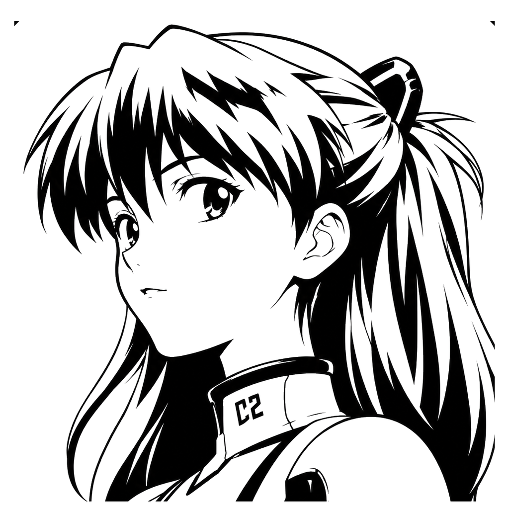
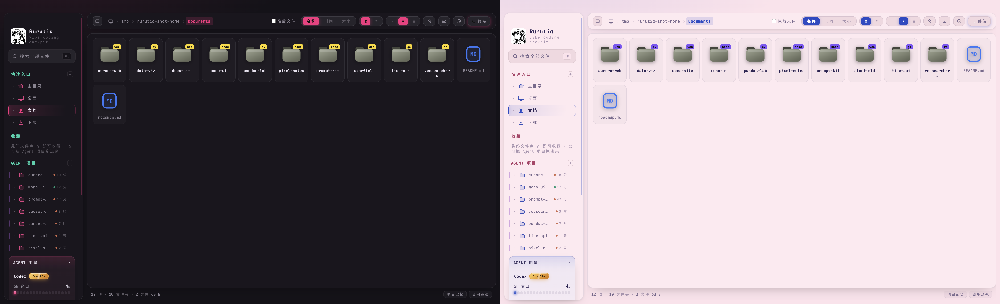
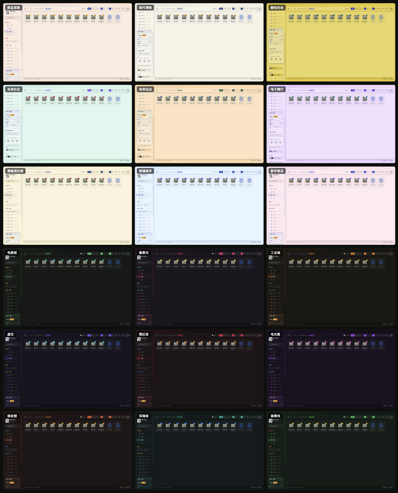
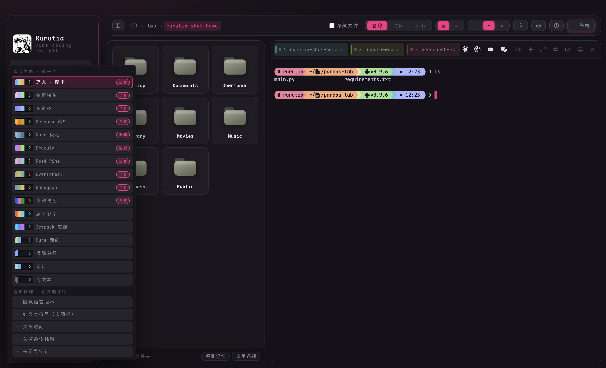
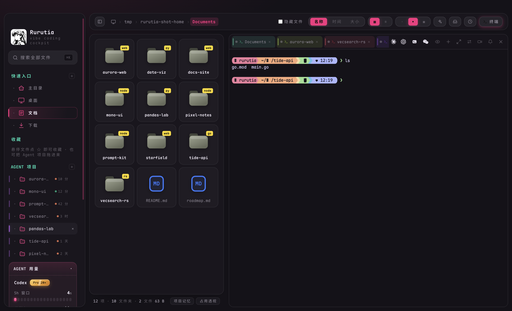
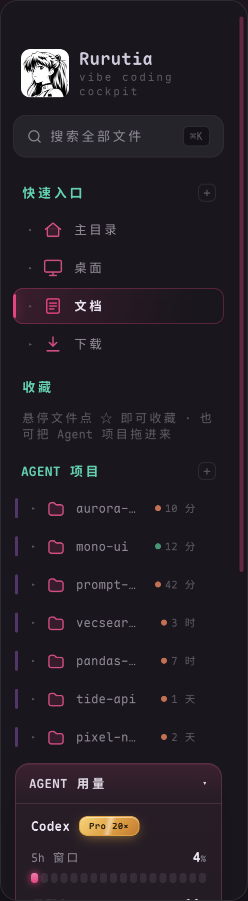

<div align="center">



# Rurutia

**A cockpit for your coding agents — a personal enhanced edition built on [FanBox](https://github.com/alchaincyf/fanbox)**

Direct Claude Code / Codex to work locally, see every file it touches and every line it changes, and take over whenever you want.<br>
On top of that, Rurutia reworks the visuals and typography, and adds **18 color skins**, a **built-in Starship terminal prompt**, and a **brand-icon terminal toolbar** — polishing the sidebar entries, the usage panel, and dozens of interaction details until everything feels smoother.

[](LICENSE)
[](#installation)
[](#installation)
[](../../releases)
[](https://github.com/alchaincyf/fanbox)

[简体中文](README.md) · [繁體中文](README.zh-TW.md) · **English** · [日本語](README.ja.md) · [한국어](README.ko.md) · [Français](README.fr.md) · [Español](README.es.md)

</div>

---

<p align="center">
  
</p>
<p align="center"><sub>▲ Main interface at a glance — the same screen, dark "Pixel Light" on the left, light "Digital Jelly" on the right. The file grid carries bold-color project badges; the sidebar gathers your agent projects and official usage.</sub></p>

---

## Table of contents

- [What is this](#what-is-this)
- [30-second overview](#30-second-overview)
- [What the original FanBox can do (full feature set)](#what-the-original-fanbox-can-do-full-feature-set)
- [What Rurutia changes](#what-rurutia-changes): 18 skins · terminal prompt · brand icons + rainbow tabs · sidebar
- [Installation](#installation)
- [Building from source](#building-from-source)
- [How the changes are organized (patch-style)](#how-the-changes-are-organized-patch-style)
- [Privacy & security](#privacy--security)
- [Tech architecture](#tech-architecture)
- [Credits & license](#credits--license)

---

## What is this

[**FanBox**](https://github.com/alchaincyf/fanbox) (by [Huashu](https://github.com/alchaincyf)) is a locally running "**cockpit for coding agents**": browse / preview / edit local files on one side while you run Claude Code, Codex, or any coding agent in a real embedded terminal on the other — and whichever file the agent edits lights up in real time. **Find your files → run the agent → see the changes**, all in a single window. Zero-dependency backend, and your data never leaves your machine.

> *"AI helps you spin up ten projects in an afternoon, and then you can never find them again. FanBox helps you find them."*

**Rurutia** is my **personal reworking** built on FanBox v2.3.1 (`c93a486`): 100% of the core capabilities come from FanBox, and I redid the visuals / fonts / color schemes, added a full skin-and-prompt system, and polished dozens of everyday touchpoints. Below, I'll first lay out **the original project's complete feature set**, then walk through **exactly what I changed**.

---

## 30-second overview

| What you want to do | In Rurutia |
|---|---|
| Find the ten projects you spun up all over the place this afternoon | `⌘K` global fuzzy search · folders tagged with node/web/py/rs/go badges so you recognize the type at a glance |
| Let the agent work — and still see what it changed | Run Claude Code / Codex in a real embedded terminal; whichever file it writes, that card lights up on the spot and the preview follows live |
| Pick up yesterday's session | Open a project to view its session history; "▶ Resume" runs `claude --resume` / `codex resume` in one click to reconnect the context |
| Keep an eye on official usage so you don't go over | The sidebar always shows Claude / Codex 5h windows + weekly quotas; a red bar + desktop notification when you near the limit |
| Dress up the whole interface to match your mood | 18 color skins + 16 terminal prompt themes — UI / terminal / code highlighting all change together |

---

## What the original FanBox can do (full feature set)

> This part is FanBox's own capability set, which Rurutia keeps in full. For the original English-language description, see [`README.fanbox.md`](README.fanbox.md).

### 🗂 Files · find and preview
- **⌘K global fuzzy search**: a fragment of the name is enough; `⌘↵` opens the whole project in your editor; the `内容:` prefix (e.g. `内容:keyword`) switches to full-text search.
- **Bold-color solid icons**: every file type "looks like itself" — PDF red, JS yellow, Markdown blue; photos and videos render at their true aspect ratio.
- **In-place preview**: Markdown rendering, live HTML output, syntax-highlighted code, inline images / video / PDF (including HEIC), archive content listings, and a checkerboard backdrop under transparent images.
- **Thumbnail acceleration**: scrolling and clicking through large folders stays under 0.1 seconds.
- **Project badges**: folder cards are tagged node / web / py / rs / go, so the ten projects you started in one afternoon are instantly recognizable by type.

### 👀 See what the agent changed
- **A living dashboard**: every time the agent writes a file, that card ripples outward and glows and breathes by how often it's edited — wherever the agent writes, the light follows.
- **Follow mode**: one click makes the file view + preview track the file the agent is currently editing — code flashes a highlight as new lines come in, HTML renders live as it's written (double-buffered, zero white flash), and Markdown renders in real time. Any manual browsing immediately hands control back to you.
- **Session replay**: drag the timeline like scrubbing a video to relive, step by step, which files the agent changed over that span.
- **Change inbox**: gathers every file modified in this session across multiple projects.
- **Git change diff**: a Monaco read-only DiffEditor shows HEAD vs the current working tree side by side.

### 🤖 Agent cockpit
- **Project memory**: open any project folder to see what the AI did there — session history (your first sentence becomes the title), the files changed in each session, the skills it triggered; "▶ Resume" runs `claude --resume` / `codex resume` in the embedded terminal to reconnect the context.
- **Screenshot fast lane**: a system screenshot pops up as a fast-lane card the moment it lands — feed it to the agent in the terminal, file it into the project's `assets/`, or annotate it first and then send.
- **AI tidy-up**: the AI looks only at metadata to produce a tidy-up proposal (it doesn't read content or touch the filesystem); you review each item, then it executes and writes a rollback log so you can undo the whole thing in one click.
- **Release wizard**: for node projects, one click strings together the version number, CHANGELOG, packaging, push, and GitHub Release.
- **Skills overview**: all your local agent skills in one view — trigger stats, health checks, context budget, and on/off toggles that don't delete any files.
- **Agent usage**: Claude Code's official 5h window / weekly quota (same source as `/usage`) + local token counts; a Codex quota snapshot.
- **Disk usage overview**: a bar ranking of real usage by `du`'s reckoning, with drill-down.

### 🖥 Terminal · command the agent
- **A real embedded terminal**: node-pty + xterm.js (WebGL rendering) — run Claude Code / vim / htop without tearing, and CJK wide characters render correctly.
- **Drag files into the terminal**: drag a file or folder from the file list into the terminal to auto-insert its path as context for the agent.
- **Clickable paths**: file paths that appear in the terminal open directly (it recognizes screenshot names with spaces, Chinese names, and wrapped long paths).
- **Select and fling it to the terminal**: select a snippet in the preview and send it into the terminal in one click, formatted with "source file + fenced block."
- **Situational awareness**: a tab dot shows the agent running / idle / exited; when it's your turn the terminal edge breathes a hint, and long tasks fire a system notification on completion.

### ✍️ Editing · what you see is what you get
- **Markdown**: Milkdown Crepe delivers Notion-style WYSIWYG, auto-saving 0.8 seconds after you stop typing.
- **Code / JSON**: the Monaco editor (the same engine as VS Code).
- **Image annotation**: pen / arrow / text / pixelate, format conversion, compression, resolution adjustment.
- **Unsaved guard**: all three editors uniformly intercept an unsaved exit.

---

## What Rurutia changes

> The core capabilities all come from FanBox; below is what I added or redid. It all revolves around four things: **looking good**, **easy to recognize**, **a usable terminal**, and **fewer interruptions**.

### 🎨 18 color skins (multi-accent system)

Click "Skins" in the sidebar to pop open a swatch grid and switch; the default is "Pixel Light." Each skin is a "**neutral base + 3 parallel accent colors** (primary: buttons / active state · secondary: section titles and links · pop: badges) + a set of semantic status colors" — the colors are more vivid, yet stay harmonious thanks to each accent's clear role. Body text / accent colors / badge text / the terminal's 16 ANSI colors **all pass WCAG contrast checks**; each skin automatically adapts the main interface, sidebar, terminal palette, and code highlighting, and even the Monaco editor's base color follows the same color temperature.

Inspired by the upscale color collections from the "Sèsuǒ" account: New Memphis / Acid Fashion / Digital Jelly / Circuit Board / Void / Lava Orange / Deep-Sea Core… 9 light and 9 dark, 18 skins in all.

<p align="center">
  
</p>
<p align="center"><sub>▲ Overview of all 18 skins (9 light, 9 dark). Switch once and the main interface / sidebar / terminal palette / code highlighting all change together.</sub></p>

The UI as a whole was modernized too: hairline borders, a consistent corner-radius rhythm, floating capsule-style segmented controls, accent-color glow, sidebar selected states, and restrained transition animations — all following the current skin's accent colors. The interface, file names, code, and terminal all use **Maple Mono CN** (covering the full Chinese + Japanese kana character set, embedded as woff2, usable offline).

### 🚀 Terminal prompt (built-in Starship · 16 themes)

**An out-of-the-box powerline prompt**: it ships with a signed and notarized starship + a Nerd Font icon font, so the moment you finish installing and open a terminal you get powerline pills (directory / git status / language version / ♥ time) — **no need to install starship yourself, no need to configure `~/.zshrc`**.

It works via ZDOTDIR injection: first it sources your real dotfile (PATH / aliases exactly as they are, so `claude` / `codex` are still found), then layers starship on top — **it only takes effect in this app's terminal, never touches any of your dotfiles, and leaves zero residue on uninstall**. macOS + zsh only.

<p align="center">
  
</p>
<p align="center"><sub>▲ The "Prompt" picker in the sidebar: pick one full theme, and the stackable modifiers allow multiple selections; switches take effect instantly, and a running terminal updates the moment you press Enter.</sub></p>

- **16 prompt themes (independent of skins)**: Pill·Mocha / Pastel / Tokyo Night / Gruvbox Rainbow / Nord Polar / Dracula / Rosé Pine / Everforest / Kanagawa / Latte Light / Flat Color / Jetpack Cockpit / Pure Minimal / Bare One-Line / Two-Line / Plain Text.
- **5 stackable modifiers (multi-select, run in parallel)**: hide language version / plain-text symbols·no icons / time off / command-duration off / drop the leading blank line.
- **A dedicated terminal palette per skin**: terminal background / cursor / selection + all 16 ANSI colors are derived from the skin; the vivid text on light skins is pushed to contrast ≥ 3.5 so it no longer smudges into the light background.

### 🖥 Terminal · brand icons + rainbow tabs

<p align="center">
  
</p>
<p align="center"><sub>▲ Embedded terminal: tabs are colored by the project's golden-angle hue (rainbow), the top bar's row of official brand icons launches Claude / Codex / WeChat directly, and the prompt is the built-in starship powerline.</sub></p>

- **Brand-icon toolbar**: the launch entries for Claude Code / Codex / WeChat and friends are swapped for **official brand vector icons**, lined up across the top bar at a glance; the remaining action buttons (preview follow / new tab / fullscreen / toggle dock / mute…) are all redrawn as single-color vector icons that follow the theme color.
- **Rainbow tabs**: each terminal tab takes its color from the project by golden angle, so when several projects sit side by side they automatically stagger into a rainbow — one glance tells you which terminal is in which project; tabs are taller, their width adapts to the file name, and they can be dragged elastically to reorder (crossing an adjacent tab makes it give way in real time).
- **"Plain terminal" button**: next to Claude Code / Codex, one click opens a clean shell (no agent) in the current folder.
- **Standalone rounded terminal card**: the header nav has an arced top edge, and the background follows the current skin's base color to blend into the whole (no longer a jarring solid-black block under dark skins); under light skins the active tab becomes a soft tint and the redundant bottom color bar is removed.

### 🗂 Sidebar · entries and add/remove for agent projects

<p align="center">
  
</p>
<p align="center"><sub>▲ Sidebar: quick entries / favorites / agent projects, with drag-to-add/remove and reorder; the agent usage panel at the bottom always shows official limits.</sub></p>

- **Quick entries you can add/remove**: ➕ to add the current folder, hover ✕ to remove (even the default items can go), persisted on the server.
- **Agent projects you can add/remove**: manually add and pin, hide the ones you don't want to see (once hidden, a scan won't surface them again); you can also drag from the list into "Favorites / Quick entries," or drag up and down within the list to set a custom order (the order persists).
- **Enhanced usage panel**: Claude Code's official limits (5h window / weekly quota) are **always shown** — a progress bar when it's fetched, and a clear reason when it isn't (not subscribed / not signed in / network restricted / no window data) + a retry; near the limit (≥85%) a **red warning bar + desktop notification** (throttled so it doesn't pester you), with an auto-refresh when the panel is expanded. The official limit endpoint is strictly rate-limited, so it now uses a 10-minute cache and reuses the last data when throttled, rather than showing "no data" on an occasional rate-limit.

### Other polish

- **Click the red ✕ = hide the window (macOS)**: it no longer destroys the window and kills the terminal; click the Dock icon to bring it back exactly as it was (terminal / state intact), and ⌘Q is the real quit.
- **The whole top strip of the window is draggable**: no longer just a corner of the brand area; the traffic lights in the top-left get plenty of clearance and never overlap the logo.
- **Redone scrollbar**: thin and rounded, following the accent color, with the track inset at both ends to clear the rounded-card corners so it no longer juts out.
- **Custom tab cursor**: the terminal tab area uses a little arrow cursor that follows the skin's accent color.
- **Automatic port fallback**: when the default 4567 is taken, it automatically moves to the next free pair of ports, so multiple instances no longer collide.
- **A custom app icon + sidebar logo**, and the app is renamed Rurutia.

---

## Installation

**macOS (Apple Silicon / arm64)**

1. Go to [**Releases**](../../releases) and download the latest `Rurutia-*.dmg`.
2. Open the dmg and drag **Rurutia** into "Applications."
3. Double-click to open and start using it.

> ✅ This build is **signed with an Apple Developer ID certificate + Apple notarization + hardened runtime** — once downloaded from Releases, just **double-click to install and use**; you won't get the "cannot verify the developer" dialog, and no extra steps are needed.

---

## Building from source

```bash
npm install
npm run rebuild        # 把 node-pty 重编到 Electron 的 ABI

# 未签名本地构建（最简单，自己用）：
CSC_IDENTITY_AUTO_DISCOVERY=false npx electron-builder --mac --dir -c.mac.identity=null
# 产物：dist/mac-arm64/Rurutia.app
```

---

## How the changes are organized (patch-style)

To keep following upstream FanBox updates, the changes are kept **additive** as much as possible, so they can be re-applied with `git rebase` after each new release:

- **New files** (no conflicts): `public/ui-patch.css` + `public/soft-patch.css` (all UI/fonts), `public/themes-patch.js` (the 18 skins), `public/prompt-patch.js` (the terminal prompt picker), `public/vendor/fonts/maple/*`, `public/vendor/icons/`, `vendor/starship/*`, `public/logo.png`, `public/favicon.png`.
- **Edited upstream files** (a few, worth watching): `public/index.html`, `public/app.js`, `server.js`, `electron/main.js`, `package.json` + `build/icon*`.

For the full change list + the steps on "how to re-apply after a new upstream release," see [`RURUTIA-PATCH.md`](RURUTIA-PATCH.md).

---

## Privacy & security

> In line with upstream FanBox, Rurutia doesn't change its security model.

- The backend only listens on the local loopback address + validates the Host header (blocking DNS rebinding), so **your data never leaves your machine**.
- All frontend assets (including the renderer, fonts, and the starship binary) are bundled locally, so it's **fully usable offline**. The only outbound requests: the Claude / Codex usage endpoints (optional) and the GitHub update check.
- HTML previews render in a sandboxed iframe on an isolated origin, with no reach to terminal capabilities.
- The terminal prompt works via ZDOTDIR injection, **never writing or changing any of your dotfiles**, and leaves zero residue on uninstall.
- Config uses atomic writes (temp + fsync + rename) so nothing is lost; deletes go to the system Trash (recoverable).

---

## Tech architecture

| Layer | What it uses |
|---|---|
| Backend | A zero-dependency Node.js `server.js` (file API + static serving + thumbnails) |
| Desktop shell | Electron 33 + node-pty (native module via asarUnpack) |
| Terminal | xterm.js + WebGL + unicode11 |
| Prompt | Built-in starship (signed and notarized) + Nerd Font, injected at runtime via ZDOTDIR |
| Editors | Monaco (code) + Milkdown Crepe (Markdown) |
| Font | Maple Mono CN (embedded woff2) |
| Packaging | electron-builder → a signed and notarized arm64 `.dmg` |

---

## Credits & license

- The core app **FanBox** is developed by **[Huashu](https://github.com/alchaincyf)** ([alchaincyf/fanbox](https://github.com/alchaincyf/fanbox)), under the MIT license. Rurutia is his personal enhanced fork, following the same [MIT license](LICENSE). FanBox's capabilities in turn build on a host of excellent open-source projects — Electron / node-pty / xterm.js / Monaco / Milkdown and more (see [`README.fanbox.md`](README.fanbox.md) for the full list).
- The **Maple Mono** font comes from [subframe7536/maple-font](https://github.com/subframe7536/maple-font) (OFL).
- The **Starship** terminal prompt comes from [starship/starship](https://github.com/starship/starship) (ISC).
- The color inspiration comes from the upscale color collections of the "**Sèsuǒ**" account.

<div align="center">
<br>

**Finder** helps you manage your files. **Your IDE** helps you write code. **Rurutia / FanBox** helps you see what the AI did on your machine.

MIT License © Rurutia · built on [Huashu's FanBox](https://github.com/alchaincyf/fanbox)

</div>
