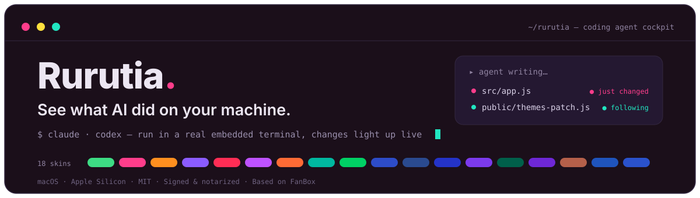
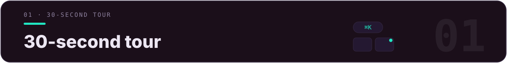
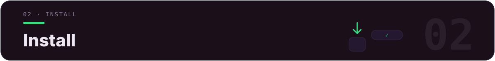
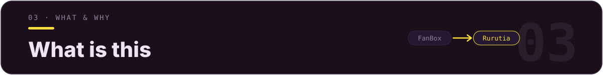
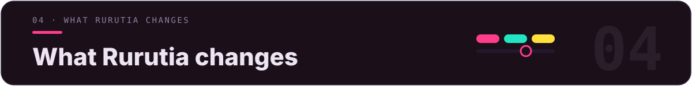
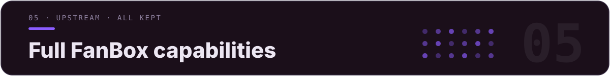
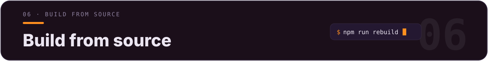
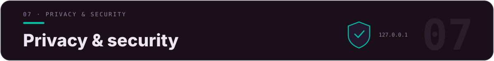
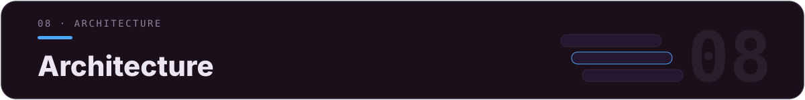

<div align="center">



[](LICENSE)
[](../../releases)
[](../../releases)
[](../../releases)
[](https://github.com/alchaincyf/fanbox)

[简体中文](README.md) · [繁體中文](README.zh-TW.md) · **English** · [日本語](README.ja.md) · [한국어](README.ko.md) · [Français](README.fr.md) · [Español](README.es.md)

</div>

<p align="center">
  
</p>
<p align="center"><sub>▲ Main interface at a glance — the same screen, dark "Pixel Light" on the left, light "Digital Jelly" on the right. The file grid carries bold-color project badges; the sidebar gathers your agent projects and official usage.</sub></p>

> **✨ Recent updates**: v2.11 Observation Deck (a terminal work-status panel) — task countdown + subtask celebrations + progress-turns-green interactions · v2.10 the screenshot fast lane upgraded to a first-class toolbar button · v2.9 terminal colors that follow the skin + 20 customizable slots · one-click rollback for round snapshots · 11 quick-launch coding agents · merged upstream FanBox v2.6.2.



| What you want to do | In Rurutia |
|---|---|
| Find the ten projects you spun up all over the place this afternoon | `⌘K` global fuzzy search · folders tagged with node/web/py/rs/go badges so you recognize the type at a glance |
| Let the agent work — and still see what it changed | Run Claude Code / Codex in a real embedded terminal; whichever file it writes, that card lights up on the spot and the preview follows live |
| Pick up yesterday's session | Open a project to view its session history; "▶ Resume" runs `claude --resume` / `codex resume` in one click to reconnect the context |
| Keep an eye on official usage so you don't go over | The sidebar always shows Claude / Codex 5h windows + weekly quotas; a red bar + desktop notification when you near the limit |
| Dress up the whole interface to match your mood | 18 color skins + 16 terminal prompt themes — UI / terminal / code highlighting all change together |



**macOS (Apple Silicon / arm64)**

1. Go to [**Releases**](../../releases) and download the latest `Rurutia-*.dmg`.
2. Open the dmg and drag **Rurutia** into "Applications."
3. Double-click to open and start using it.

> ✅ **Signed with an Apple Developer ID certificate + Apple notarization + hardened runtime**: double-click to use it right after downloading — no "cannot verify the developer" dialog.



[**FanBox**](https://github.com/alchaincyf/fanbox) (by [Huashu](https://github.com/alchaincyf)) is a locally running "**cockpit for coding agents**": browse / preview / edit local files on one side while you run Claude Code, Codex, or any coding agent in a real embedded terminal on the other — whichever file the agent edits lights up in real time. **Find your files → run the agent → see the changes**, all in a single window. Zero-dependency backend, and your data never leaves your machine.

> *"AI helps you spin up ten projects in an afternoon, and then you can never find them again. FanBox helps you find them."*

**Rurutia** is my **personal enhanced fork** built on FanBox: 100% of the core capabilities come from upstream; I redid the visuals / fonts / color scheme, added two systems — skins and a terminal prompt — and polished dozens of everyday touchpoints.



> Four things drive it: **looking good**, **easy to recognize**, **a usable terminal**, and **fewer interruptions**.

### 🎨 18 color skins

Each skin is a "neutral base + 3 parallel accent colors + a set of semantic status colors" — body text / accent colors / badge text / the terminal's 16 ANSI colors **all pass WCAG contrast checks**; switch a skin and the main interface, sidebar, terminal palette, code highlighting, and Monaco's base color all change together. 9 light and 9 dark, inspired by the "Sèsuǒ" WeChat account.

<p align="center">
  
</p>
<p align="center"><sub>▲ Overview of all 18 skins (9 light, 9 dark). Default is "Pixel Light."</sub></p>

The UI as a whole was modernized too: hairline borders, a consistent corner-radius rhythm, capsule-style segmented controls, restrained transition animations; the interface, file names, code, and terminal all use **Maple Mono CN** (covering the full Chinese + kana character set, embedded as woff2, usable offline).

### 🚀 Terminal prompt (built-in Starship · 16 themes)

Out of the box you get a powerline pill prompt (directory / git status / language version / time) — **no need to install starship, no need to configure `~/.zshrc`**. It works via ZDOTDIR injection: it first sources your real dotfile (PATH / aliases exactly as they are), then layers starship on top — **it only takes effect in this app's terminal, never touches any dotfile, and leaves zero residue on uninstall** (macOS + zsh).

<p align="center">
  
</p>
<p align="center"><sub>▲ Pick one of 16 themes, plus 5 stackable modifiers; switches take effect instantly — a running terminal updates the moment you press Enter.</sub></p>

### 🎛 Terminal colors · follow the skin, or pick your own

The terminal's 16 ANSI colors are no longer one shared palette across all 18 skins: blue / magenta / cyan are swapped for that skin's own accent colors by closest hue, while red / green / yellow keep their meaning; run Claude Code / Codex under `dark-ansi` and the terminal UI recolors with every skin switch. Want it more personal? The **Terminal Colors** panel has 20 slots, each labeled with what Claude Code actually uses it for (borders / errors / success / linked paths…) — open the color picker and every terminal updates instantly, with overrides remembered separately per skin. The 9 light skins are dimmed overall too (brightest surface pressed under 64%) — easy on the eyes during long sessions.

### 🖥 Terminal · brand icons + rainbow tabs

<p align="center">
  
</p>
<p align="center"><sub>▲ Tabs are colored by the project's golden-angle hue; the top bar's official brand icons launch Claude / Codex / WeChat directly.</sub></p>

- **Brand-icon toolbar**: entries like Claude Code / Codex / WeChat use official vector icons; the remaining action buttons are redrawn as single-color vectors that follow the theme color.
- **Rainbow tabs**: each terminal tab takes its color from the project by golden angle, so multiple projects side by side automatically stagger into a rainbow; tabs are width-adaptive and can be dragged elastically to reorder.
- **A "plain terminal" button**: one click opens a clean shell (no agent) in the current folder.
- **Standalone rounded terminal card**: the background blends into the current skin, no longer a jarring solid-black block under dark skins.

### 🗂 Sidebar · entries and usage

<p align="center">
  
</p>

- **Quick entries / agent projects can be added, removed, and reordered**: ➕ to add, hover ✕ to remove, drag to set a custom order — all persisted.
- **Enhanced usage panel**: Claude Code's official limits (5h window / weekly quota) are always shown; when they can't be fetched it states the reason + offers a retry; ≥85% triggers a red warning bar + desktop notification; a 10-minute cache rides out official rate limits.

### Other polish

Clicking the red ✕ hides the window instead of killing the terminal (⌘Q is the real quit) · the entire top strip of the window is draggable · a thin, rounded scrollbar follows the accent color · the default port auto-advances when taken (so multiple instances don't collide) · a custom app icon and logo · **7 interface languages** (简体中文 / 繁體中文 / English / 日本語 / 한국어 / Français / Español, user content areas are never translated).



Search and preview, a living change dashboard, follow mode, session replay, a change inbox, Git diff, project memory with one-click session resume, a screenshot fast lane, AI tidy-up, a release wizard, Skills overview, round snapshots, a real embedded terminal with 11 one-click agent launchers, WYSIWYG editing……

<details>
<summary><b>Expand the full feature list</b></summary>

### 🗂 Files · find and preview
- **⌘K global fuzzy search**: a name fragment is enough; `⌘↵` opens the whole project in your editor; `内容:关键词` switches to full-text search.
- **Bold-color solid icons**: every file type "looks like itself" — PDF red, JS yellow, Markdown blue; photos and videos render at their true aspect ratio.
- **In-place preview**: Markdown rendering, live HTML output, syntax-highlighted code, inline images / video / PDF (including HEIC), and archive content listings.
- **Thumbnail acceleration**: scrolling and clicking through large folders stays under 0.1 seconds.
- **Project badges**: folder cards are tagged node / web / py / rs / go.

### 👀 See what the agent changed
- **A living dashboard**: every time the agent writes a file, that card ripples outward on the spot and glows and breathes by how often it's edited.
- **Follow mode**: the file view + preview track whichever file the agent is currently editing — code flashes a highlight as new lines come in, HTML renders live with double buffering and zero white flash; any manual browsing immediately hands control back to you.
- **Session replay**: drag the timeline to relive, step by step, which files the agent changed.
- **Change inbox**: gathers every file changed in this session, across projects.
- **Git change diff**: a Monaco DiffEditor shows HEAD vs the working tree side by side.

### 🤖 Agent cockpit
- **Project memory**: session history (your first sentence becomes the title), the files changed in each session, the skills it triggered; "▶ Resume" reconnects the context in one click.
- **Screenshot fast lane**: a system screenshot pops up as a fast-lane card the moment it lands — feed it to the agent, file it into the project's assets, or annotate it first and then send.
- **AI tidy-up**: the AI looks only at metadata to produce a proposal (it doesn't read content); you review each item, then it executes — with a one-click undo for the whole batch.
- **Release wizard**: for node projects, one click strings together the version number, CHANGELOG, packaging, and GitHub Release.
- **Skills overview**: every local agent skill in one view — trigger stats, health checks, context budget, and on/off toggles that don't delete any files.
- **Agent usage**: Claude Code's official 5h window / weekly quota + local token stats; a Codex quota snapshot.
- **Round snapshots (a seatbelt)**: before each round the agent starts, a full project snapshot is taken automatically (non-git folders go through shadow git); roll back to any round in one click.
- **Disk usage overview**: a bar ranking of real usage by `du`'s reckoning, with drill-down.

### 🖥 Terminal · command the agent
- **A real embedded terminal**: node-pty + xterm.js (WebGL) — run Claude Code / vim / htop without tearing, and CJK wide characters render correctly.
- **Drag files into the terminal**: auto-inserts the path as context for the agent.
- **Clickable paths**: recognizes names with spaces, Chinese names, and wrapped long paths.
- **Select and fling it to the terminal**: select a snippet in the preview and send it into the terminal, formatted as "source file + fenced block."
- **Situational awareness**: a tab dot shows running / idle / exited; when it's your turn the terminal edge breathes a hint, and long tasks fire a system notification on completion.
- **11 quick-launch coding agents**: a built-in registry (Claude Code / Codex / Hermes / Kimi / opencode…); one click copies the install command for anything not installed, and config.json lets you customize it.
- **Update capsule**: when a new version is out, it floats up in the top bar — one click downloads the dmg.

### ✍️ Editing · what you see is what you get
- **Markdown**: Milkdown Crepe (Notion-style), auto-saving 0.8 seconds after you stop typing.
- **Code / JSON**: Monaco (the same engine as VS Code).
- **Image annotation**: pen / arrow / text / pixelate, format conversion, and compression.
- **Unsaved guard**: all three editors uniformly intercept an unsaved exit.

For the original English-language description, see [`README.fanbox.md`](README.fanbox.md).

</details>



```bash
npm install
npm run rebuild        # rebuild node-pty against Electron's ABI

# unsigned local build (for yourself):
CSC_IDENTITY_AUTO_DISCOVERY=false npx electron-builder --mac --dir -c.mac.identity=null
# output: dist/mac-arm64/Rurutia.app
```

The changes are organized as **additive patches** (new files like `ui-patch.css` / `themes-patch.js` / `prompt-patch.js` plus a handful of edits to upstream files), so they're easy to re-apply with `git rebase` after a new upstream release — see [`RURUTIA-PATCH.md`](RURUTIA-PATCH.md) for the full list and the steps to apply them.



> In line with upstream FanBox, Rurutia doesn't change its security model.

- The backend only listens on the local loopback address + validates the Host header, so **your data never leaves your machine**.
- All frontend assets (the renderer, fonts, the starship binary) are bundled locally, so it's **fully usable offline**; the only outbound requests are the Claude / Codex usage endpoints (optional) and the GitHub update check.
- HTML previews render in a sandboxed iframe on an isolated origin, with no reach to terminal capabilities.
- The prompt works via ZDOTDIR injection, **never writing or changing any dotfile**, and leaves zero residue on uninstall.
- Config uses atomic writes (temp + fsync + rename); deletes go to the system Trash (recoverable).



| Layer | What it uses |
|---|---|
| Backend | A zero-dependency Node.js `server.js` (file API + static serving + thumbnails) |
| Desktop shell | Electron 33 + node-pty (native module via asarUnpack) |
| Terminal | xterm.js + WebGL + unicode11 |
| Prompt | Built-in starship (signed and notarized) + Nerd Font, injected at runtime via ZDOTDIR |
| Editors | Monaco (code) + Milkdown Crepe (Markdown) |
| Font | Maple Mono CN (embedded woff2) |
| Packaging | electron-builder → a signed and notarized arm64 `.dmg` |


- The core app **FanBox** is developed by **[Huashu](https://github.com/alchaincyf)** ([alchaincyf/fanbox](https://github.com/alchaincyf/fanbox)), under the MIT license. Rurutia is his personal enhanced fork, following the same [MIT license](LICENSE). See [`README.fanbox.md`](README.fanbox.md) for the full list of upstream dependencies.
- The **Maple Mono** font comes from [subframe7536/maple-font](https://github.com/subframe7536/maple-font) (OFL).
- The **Starship** terminal prompt comes from [starship/starship](https://github.com/starship/starship) (ISC).
- The color inspiration comes from the "**Sèsuǒ**" WeChat account's upscale color collections.

<div align="center">
<br>

**Finder** helps you manage your files. **Your IDE** helps you write code. **Rurutia / FanBox** helps you see what the AI did on your machine.

MIT License © Rurutia · built on [Huashu's FanBox](https://github.com/alchaincyf/fanbox)

</div>
