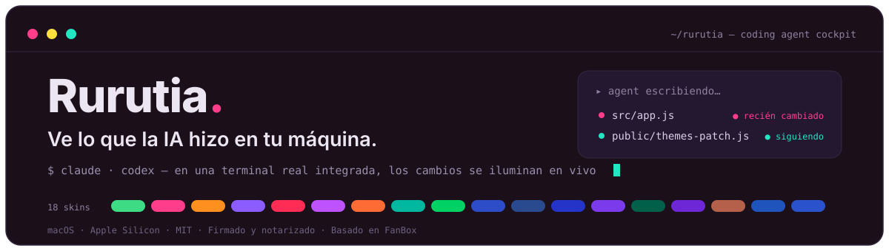
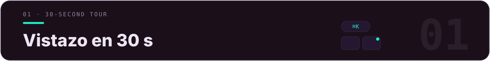
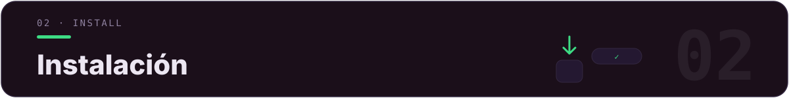
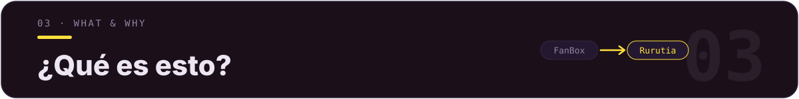
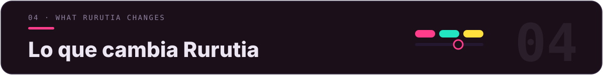
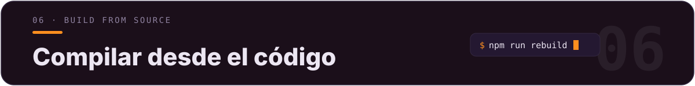
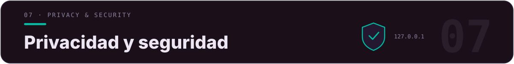
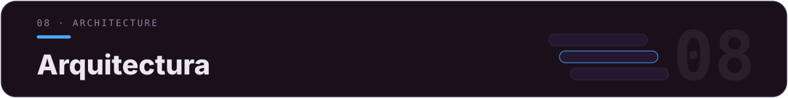
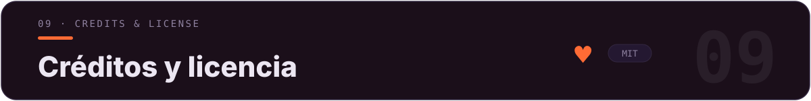

<div align="center">



[](LICENSE)
[](../../releases)
[](../../releases)
[](../../releases)
[](https://github.com/alchaincyf/fanbox)

[简体中文](README.md) · [繁體中文](README.zh-TW.md) · [English](README.en.md) · [日本語](README.ja.md) · [한국어](README.ko.md) · [Français](README.fr.md) · **Español**

</div>

<p align="center">
  
</p>
<p align="center"><sub>▲ Vista general de la interfaz principal —— la misma interfaz, a la izquierda la oscura «Luz de Píxel» y a la derecha la clara «Gelatina Digital». La cuadrícula de archivos lleva insignias de proyecto en colores vivos y la barra lateral resume los proyectos de Agent y el uso oficial.</sub></p>

> **✨ Novedades recientes**: v2.11 sala de observación (panel de estado de trabajo de la terminal) —— cuenta regresiva de tareas + celebración de subtareas + interacción de progreso que se vuelve verde · v2.10 vía directa para capturas ascendida a botón de primer nivel en la barra de herramientas · v2.9 colores de terminal que siguen el skin + 20 ranuras personalizables · instantáneas por ronda con reversión en un clic · 11 coding agents de lanzamiento rápido · fusión de FanBox v2.6.2 upstream.



| Lo que quieres hacer | En Rurutia |
|---|---|
| Recuperar los diez proyectos que arrancaste sin orden en una tarde | Búsqueda difusa global con `⌘K` · las carpetas llevan insignias node/web/py/rs/go para reconocer el tipo de un vistazo |
| Poner al agent a trabajar y aun así ver con claridad qué cambió | Terminal real integrada para ejecutar Claude Code / Codex; el archivo que escribe hace que su tarjeta brille al instante y la previsualización lo sigue en tiempo real |
| Retomar la sesión de ayer | Abre el proyecto para ver las sesiones anteriores; «▶ Retomar» recupera el contexto con `claude --resume` / `codex resume` en un clic |
| Vigilar el uso oficial para no pasarte del límite | La barra lateral muestra siempre la ventana de 5 h + la cuota semanal de Claude / Codex; al acercarte al límite, barra roja + notificación de escritorio |
| Cambiar el aspecto de toda la interfaz según tu humor | 18 skins de color + 16 temas de prompt de terminal; la UI / la terminal / el resaltado de código cambian todos a la vez |



**macOS (Apple Silicon / arm64)**

1. Ve a [**Releases**](../../releases) y descarga el `Rurutia-*.dmg` más reciente.
2. Abre el dmg y arrastra **Rurutia** a «Aplicaciones».
3. Haz doble clic para abrir y empezar a usarlo.

> ✅ Firmado con **certificado Apple Developer ID + notarización de Apple + hardened runtime**: descárgalo y ábrelo con doble clic directamente, sin el aviso «no se puede verificar el desarrollador».



[**FanBox**](https://github.com/alchaincyf/fanbox) (creado por [Huashu](https://github.com/alchaincyf)) es una «**cabina de mando para coding agents**» que corre en local: navegas / previsualizas / editas archivos locales mientras ejecutas Claude Code, Codex o cualquier coding agent en una terminal real integrada, y cada archivo que el agent modifica se resalta en tiempo real —— **recuperar archivos → ejecutar el agent → ver con claridad los cambios**, todo en una sola ventana. Backend sin dependencias, los datos no salen de tu máquina.

> *«La IA te ayuda a arrancar diez proyectos en una tarde, y luego nunca más los vuelves a encontrar. FanBox te ayuda a recuperarlos.»*

**Rurutia** es el **fork personal mejorado** que hice sobre FanBox: las capacidades centrales provienen 100% del proyecto original; rehíce lo visual / la tipografía / los colores, agregué los dos sistemas de skins y de prompts de terminal, y pulí decenas de detalles de comodidad cotidiana.



> Todo gira en torno a cuatro cosas: **que se vea bien**, **que sea fácil de reconocer**, **una terminal cómoda de usar** y **que moleste poco**.

### 🎨 18 skins de color

Cada skin es una «base neutra + 3 colores de acento en paralelo + un juego de colores de estado semántico»; el texto / los colores de acento / la tipografía de las insignias / los 16 ANSI de la terminal **pasan todos la verificación de contraste WCAG**. Cambia de skin y la interfaz principal, la barra lateral, los colores de la terminal, el resaltado de código y el fondo de Monaco cambian todos a la vez. 9 claros y 9 oscuros, inspirados en la cuenta de WeChat «色所».

<p align="center">
  
</p>
<p align="center"><sub>▲ Vista general de los 18 skins (9 claros y 9 oscuros). El predeterminado es «Luz de Píxel».</sub></p>

La UI en su conjunto también se modernizó: bordes finísimos, un ritmo unificado de esquinas redondeadas, controles segmentados tipo cápsula y transiciones contenidas. La interfaz, los nombres de archivo, el código y la terminal usan de forma unificada **Maple Mono CN** (incluye el set completo de caracteres chinos + kana japonés, woff2 incrustado, disponible sin conexión).

### 🚀 Prompt de terminal (Starship incluido · 16 temas)

Al instante ya tienes las pastillas powerline (directorio / estado de git / versión del lenguaje / hora) —— **sin instalar starship por tu cuenta ni configurar `~/.zshrc`**. Se inyecta vía ZDOTDIR: primero hace source de tu dotfile real (PATH / alias idénticos al detalle) y luego superpone starship; **solo surte efecto en la terminal de esta app, no toca ningún dotfile y no deja residuos al desinstalar** (macOS + zsh).

<p align="center">
  
</p>
<p align="center"><sub>▲ Elige uno de los 16 temas + hasta 5 modificadores combinables; el cambio surte efecto al instante, y una terminal en ejecución cambia con solo pulsar Enter.</sub></p>

### 🎛 Colores de terminal · siguen el skin, o a tu gusto

Los 16 colores ANSI de la terminal ya no son una paleta única compartida por los 18 skins: azul / magenta / cian se sustituyen por los acentos del propio skin (emparejados por tono), rojo / verde / amarillo conservan su semántica; corre Claude Code / Codex en `dark-ansi` y, al cambiar de skin, los colores de la terminal cambian con él. ¿Lo quieres más a tu manera? El panel **«Colores de terminal»** tiene 20 ranuras, cada una etiquetada con su uso real en Claude Code (bordes / errores / éxito / rutas y enlaces…); un selector de color aplica los cambios a todas las terminales al instante y se recuerda por separado en cada skin. Los 9 skins claros bajan de luminancia en conjunto (la superficie más clara queda por debajo del 64 %) —— cómodo para la vista aunque los mires largo rato.

### 🖥 Terminal · iconos de marca + pestañas arcoíris

<p align="center">
  
</p>
<p align="center"><sub>▲ Las pestañas se colorean por proyecto con el ángulo áureo; los iconos de marca oficiales de la barra superior lanzan directamente Claude / Codex / WeChat.</sub></p>

- **Barra de herramientas con iconos de marca**: los accesos como Claude Code / Codex / WeChat usan iconos vectoriales de marca oficiales; el resto de los botones de acción se rediseñaron como iconos vectoriales monocromos que siguen el color del tema.
- **Pestañas arcoíris**: cada pestaña de terminal toma su color por proyecto con el ángulo áureo, y al tener varios proyectos lado a lado se escalonan automáticamente formando un arcoíris; el ancho se adapta y se pueden reordenar arrastrándolas con elasticidad.
- **Botón «Terminal normal»**: abre con un clic un shell limpio en la carpeta actual (sin agent).
- **Tarjeta de terminal con esquinas redondeadas propia**: el fondo se integra con el skin actual, y en los skins oscuros ya no es un bloque negro abrupto.

### 🗂 Barra lateral · accesos y uso

<p align="center">
  
</p>

- **Accesos rápidos / proyectos de Agent con agregar y quitar**: ➕ para añadir, ✕ al pasar el cursor para quitar, y reordena arrastrando; todo persiste.
- **Panel de uso mejorado**: el límite oficial de Claude Code (ventana de 5 h / cuota semanal) se muestra siempre; si no se puede obtener, indica el motivo + reintentar; ≥85% barra roja de advertencia + notificación de escritorio; caché de 10 minutos para resistir la limitación de tasa oficial.

### Otros pulidos

Clic en la ✕ roja = oculta la ventana en vez de matar la terminal (⌘Q es la salida de verdad) · toda la franja superior de la ventana se puede arrastrar · barra de desplazamiento fina y redondeada que sigue el color de acento · si el puerto predeterminado está ocupado, avanza automáticamente al siguiente (sin conflictos entre varias instancias) · icono de aplicación y logo personalizados · **interfaz en 7 idiomas** (chino simplificado, chino tradicional, inglés, japonés, coreano, francés y español; el contenido del usuario no se traduce).


Búsqueda y previsualización, panel vivo de cambios, modo seguimiento, repetición de sesión, bandeja de cambios, diff de Git, memoria del proyecto y retomar sesión en un clic, vía directa para capturas, organización con IA, asistente de publicación, vista de Skills, instantáneas por ronda, terminal real integrada con 11 agentes de lanzamiento rápido, edición WYSIWYG…

<details>
<summary><b>Ver la lista completa de funciones</b></summary>

### 🗂 Archivos · recuperación y previsualización
- **Búsqueda difusa global con ⌘K**: basta con recordar un fragmento del nombre; `⌘↵` abre el proyecto completo en el editor; el prefijo `内容:` cambia a la búsqueda de texto completo.
- **Iconos sólidos de colores vivos**: cada tipo de archivo «se parece a sí mismo» —— PDF en rojo, JS en amarillo, Markdown en azul; las fotos y los videos se muestran con su proporción real.
- **Previsualización en el sitio**: renderizado de Markdown, HTML como producto en vivo, resaltado de sintaxis de código, imágenes/videos/PDF integrados (incluido HEIC), lista del contenido de los archivos comprimidos.
- **Miniaturas aceleradas**: el desplazamiento y los clics en carpetas grandes responden en menos de 0,1 segundos.
- **Insignias de proyecto**: las tarjetas de carpeta llevan las insignias node / web / py / rs / go.

### 👀 Ver qué cambió el agent
- **Panel vivo**: cada vez que el agent escribe un archivo, su tarjeta lanza un efecto de onda y brilla con un latido según la frecuencia de los cambios.
- **Modo seguimiento**: la vista de archivos + la previsualización siguen el archivo que el agent está editando —— el código resalta las líneas recién escritas, el HTML se renderiza en vivo con doble búfer sin parpadeo en blanco; cualquier navegación manual te devuelve el control de inmediato.
- **Repetición de sesión**: arrastra la línea de tiempo como si fuera un video para revivir, paso a paso, qué archivos cambió el agent.
- **Bandeja de cambios**: reúne, a través de varios proyectos, todos los archivos modificados en la sesión actual.
- **Diff de cambios de Git**: el DiffEditor de Monaco muestra lado a lado HEAD vs el área de trabajo.

### 🤖 Cabina de mando del Agent
- **Memoria del proyecto**: las sesiones anteriores (tu primera frase como título), los archivos cambiados en cada sesión y las skills que se activaron; «▶ Retomar» recupera el contexto en un clic.
- **Vía directa para capturas**: en cuanto una captura del sistema se guarda en disco, aparece una tarjeta de acceso directo —— para pasársela al agent, añadirla a los materiales del proyecto, o anotarla antes de enviarla.
- **Organización con IA**: la IA solo mira los metadatos para proponer una organización (no lee el contenido); tras revisarla punto por punto, se ejecuta + se puede deshacer todo en un clic.
- **Asistente de publicación**: para proyectos node, encadena en un clic el número de versión, el CHANGELOG, el empaquetado y el GitHub Release.
- **Vista de Skills**: todas las skills de agent de esta máquina en una sola vista —— estadísticas de activación, chequeo de salud, presupuesto de context e interruptores de encendido/apagado que no eliminan archivos.
- **Uso del Agent**: la ventana oficial de 5 h / cuota semanal de Claude Code + el conteo local de tokens; una instantánea del límite de Codex.
- **Instantáneas por ronda (cinturón de seguridad)**: antes de cada ronda del agent se guarda automáticamente el estado completo del proyecto (un git sombra cubre los proyectos sin git); un clic para volver a cualquier ronda anterior.
- **Vista del uso de disco**: un ranking de barras con el uso real según el criterio de `du`, con posibilidad de profundizar.

### 🖥 Terminal · dar órdenes al agent
- **Terminal real integrada**: node-pty + xterm.js (WebGL); ejecuta Claude Code / vim / htop sin glitches de pantalla, y muestra correctamente los caracteres anchos del chino.
- **Arrastrar archivos a la terminal**: la ruta se inserta automáticamente para dársela al agent como contexto.
- **Rutas clicables**: reconoce nombres con espacios, nombres en chino y rutas largas con salto de línea.
- **Selecciona y envía a la terminal**: selecciona un fragmento de texto en la previsualización y se envía a la terminal con formato «origen del archivo + bloque de código cercado».
- **Conciencia de estado**: el punto de la pestaña indica si está en ejecución/inactivo/cerrado; cuando es tu turno, el borde de la terminal late como aviso, y al terminar una tarea larga se envía una notificación del sistema.
- **11 agentes de lanzamiento rápido**: registro integrado (Claude Code / Codex / Hermes / Kimi / opencode…); si no está instalado, copia el comando de instalación en un clic; personalizable vía config.json.
- **Cápsula de actualización**: cuando hay una versión nueva, aparece una cápsula arriba —— un clic descarga el dmg.

### ✍️ Edición · lo que ves es lo que obtienes
- **Markdown**: Milkdown Crepe (al estilo Notion), guardado automático 0,8 segundos después de dejar de escribir.
- **Código/JSON**: Monaco (el mismo núcleo que VS Code).
- **Anotación de imágenes**: pincel/flechas/texto/pixelado, conversión de formato, compresión.
- **Guardián de cambios sin guardar**: los tres editores interceptan de forma unificada la salida con cambios sin guardar.

La documentación original en inglés está en [`README.fanbox.md`](README.fanbox.md).

</details>



```bash
npm install
npm run rebuild        # recompilar node-pty para el ABI de Electron

# build local sin firmar (uso propio):
CSC_IDENTITY_AUTO_DISCOVERY=false npx electron-builder --mac --dir -c.mac.identity=null
# salida: dist/mac-arm64/Rurutia.app
```

Los cambios se organizan como **parches aditivos** (archivos nuevos como `ui-patch.css` / `themes-patch.js` / `prompt-patch.js` + unas pocas ediciones a archivos upstream), para poder reaplicarlos con `git rebase` cuando upstream saca una versión nueva —— la lista completa y los pasos para reaplicarlos están en [`RURUTIA-PATCH.md`](RURUTIA-PATCH.md).



> Igual que FanBox upstream, Rurutia no altera su modelo de seguridad.

- El backend solo escucha en la dirección loopback local + valida el encabezado Host, **los datos no salen de tu máquina**.
- Todos los recursos del frontend (el renderizador, las tipografías, el binario de starship) vienen integrados localmente, **totalmente utilizable sin conexión**; las únicas peticiones que salen a la red son la API de uso de Claude / Codex (opcional) y la comprobación de actualizaciones de GitHub.
- La previsualización de HTML se renderiza en un iframe en sandbox con origin aislado, sin acceso a las capacidades de la terminal.
- El prompt se inyecta vía ZDOTDIR, **no escribe ni modifica ningún dotfile**, y no deja residuos al desinstalar.
- La configuración usa escritura atómica (temp + fsync + rename); las eliminaciones van a la papelera del sistema (recuperables).



| Capa | Qué se usa |
|---|---|
| Backend | Node.js `server.js` sin dependencias (API de archivos + servidor estático + miniaturas) |
| Carcasa de escritorio | Electron 33 + node-pty (módulos nativos asarUnpack) |
| Terminal | xterm.js + WebGL + unicode11 |
| Prompt | starship integrado (firmado y notarizado) + Nerd Font, inyección en tiempo de ejecución vía ZDOTDIR |
| Editor | Monaco (código) + Milkdown Crepe (Markdown) |
| Tipografía | Maple Mono CN (woff2 incrustado) |
| Empaquetado | electron-builder → `.dmg` arm64 firmado + notarizado |



- La aplicación central **FanBox** fue desarrollada por **[Huashu](https://github.com/alchaincyf)** ([alchaincyf/fanbox](https://github.com/alchaincyf/fanbox)) con licencia MIT. Rurutia es su fork personal mejorado y se rige por la misma [licencia MIT](LICENSE). La lista completa de dependencias upstream está en [`README.fanbox.md`](README.fanbox.md).
- La tipografía **Maple Mono** proviene de [subframe7536/maple-font](https://github.com/subframe7536/maple-font) (OFL).
- El prompt de terminal **Starship** proviene de [starship/starship](https://github.com/starship/starship) (ISC).
- La inspiración de las paletas proviene de la colección de colores con aire sofisticado de la cuenta de WeChat «**色所**».

<div align="center">
<br>

**Finder** te ayuda a gestionar archivos. El **IDE** te ayuda a escribir código. **Rurutia / FanBox** te ayuda a ver con claridad qué hizo la IA en tu máquina.

MIT License © Rurutia · basado en el [FanBox de Huashu](https://github.com/alchaincyf/fanbox)

</div>
