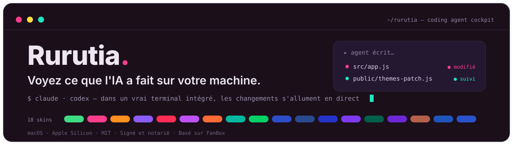
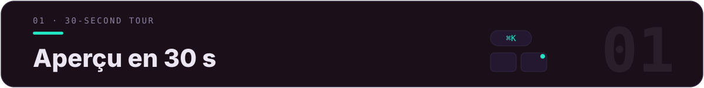
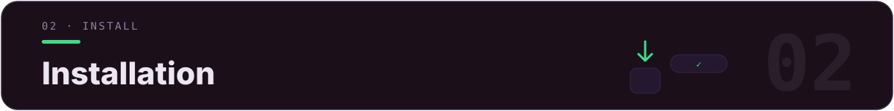
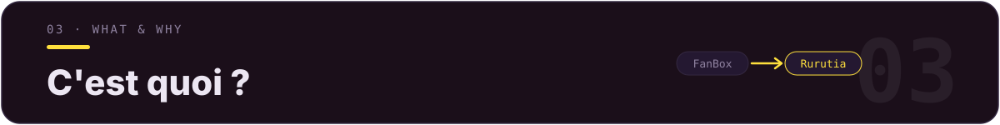
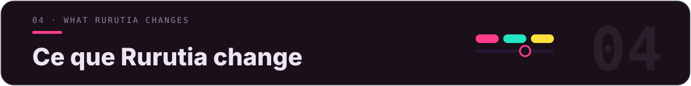
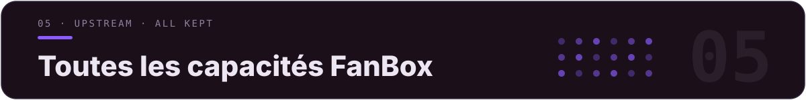
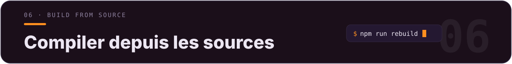
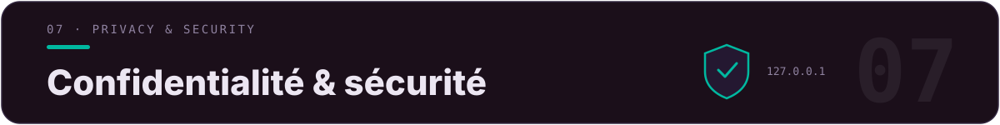
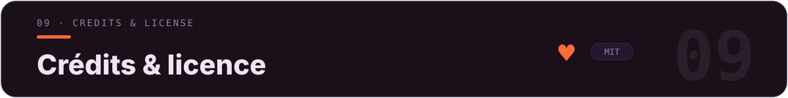

<div align="center">



[](LICENSE)
[](../../releases)
[](../../releases)
[](../../releases)
[](https://github.com/alchaincyf/fanbox)

[简体中文](README.md) · [繁體中文](README.zh-TW.md) · [English](README.en.md) · [日本語](README.ja.md) · [한국어](README.ko.md) · **Français** · [Español](README.es.md)

</div>

<p align="center">
  
</p>
<p align="center"><sub>▲ Vue d'ensemble de l'interface principale — la même interface, « Lumière Pixel » sombre à gauche, « Gelée Numérique » clair à droite. La grille de fichiers porte des badges de projet aux couleurs vives, la barre latérale rassemble les projets Agent et l'usage officiel.</sub></p>

> **✨ Nouveautés récentes** : v2.11 Cockpit d'observation (panneau d'état du terminal) — compte à rebours des tâches + célébration des sous-tâches + progression interactive qui vire au vert · v2.10 la voie express captures d'écran devient un bouton de premier rang dans la barre d'outils · v2.9 les couleurs du terminal suivent le skin + 20 emplacements personnalisables · restauration en un clic des instantanés de tour · 11 coding agents à lancement rapide · fusion de FanBox v2.6.2 en amont.



| Ce que vous voulez faire | Dans Rurutia |
|---|---|
| Retrouver les dix projets lancés en vrac en un après-midi | Recherche floue globale `⌘K` · les dossiers portent des badges node/web/py/rs/go pour reconnaître le type d'un coup d'œil |
| Faire travailler l'agent tout en voyant ce qu'il modifie | Un vrai terminal intégré fait tourner Claude Code / Codex ; le fichier qu'il écrit, sa carte s'illumine aussitôt et l'aperçu suit en temps réel |
| Reprendre la session d'hier | Ouvrez un projet pour voir l'historique des sessions, « ▶ Reprendre » relance en un clic `claude --resume` / `codex resume` et récupère le contexte |
| Surveiller l'usage officiel sans dépasser le quota | La barre latérale affiche en permanence la fenêtre de 5 h + le quota hebdomadaire de Claude / Codex, avec barre rouge + notification bureau à l'approche de la limite |
| Habiller toute l'interface selon l'humeur | 18 skins de couleurs + 16 thèmes d'invite de terminal, l'UI / le terminal / la coloration du code changent ensemble |



**macOS (Apple Silicon / arm64)**

1. Téléchargez le dernier `Rurutia-*.dmg` depuis les [**Releases**](../../releases).
2. Ouvrez le dmg et glissez **Rurutia** dans « Applications ».
3. Double-cliquez pour ouvrir et c'est prêt.

> ✅ **Signée avec un certificat Apple Developer ID + notarisée par Apple + hardened runtime** : téléchargez et double-cliquez pour l'utiliser directement, aucun message « développeur impossible à vérifier » ne s'affichera.



[**FanBox**](https://github.com/alchaincyf/fanbox) (auteur : [Huashu](https://github.com/alchaincyf)) est un « **cockpit de coding agent** » qui s'exécute en local : d'un côté vous parcourez / prévisualisez / éditez vos fichiers locaux, de l'autre vous faites tourner Claude Code, Codex ou n'importe quel coding agent dans un vrai terminal intégré — le fichier que l'agent modifie est mis en surbrillance en temps réel, **retrouver les fichiers → lancer l'agent → voir clairement les changements**, le tout dans une seule fenêtre. Backend sans dépendance, les données ne quittent pas la machine.

> *« L'IA vous fait démarrer dix projets en un après-midi, et ensuite vous ne les retrouvez plus jamais. FanBox vous aide à les retrouver. »*

**Rurutia** est la **branche personnelle enrichie** que j'ai construite par-dessus FanBox : les capacités de base proviennent à 100 % de l'amont, j'ai refait le visuel / les polices / les couleurs, ajouté les deux systèmes de skins et d'invites de terminal, et peaufiné des dizaines de détails du quotidien.



> Autour de quatre objectifs : **être beau, être lisible, avoir un bon terminal, déranger le moins possible**.

### 🎨 18 skins de couleurs

Chaque skin est « un fond neutre + 3 couleurs d'accent juxtaposées + un jeu de couleurs d'état sémantiques » ; le texte courant / les couleurs d'accent / le texte des badges / les 16 couleurs ANSI du terminal **passent tous la validation de contraste WCAG** ; changez de skin, et l'interface principale, la barre latérale, les couleurs du terminal, la coloration du code et le fond de Monaco basculent ensemble. 9 clairs, 9 sombres, inspirés de la collection du compte public « 色所 ».

<p align="center">
  
</p>
<p align="center"><sub>▲ Vue d'ensemble des 18 skins (9 clairs, 9 sombres). Par défaut : « Lumière Pixel ».</sub></p>

L'UI dans son ensemble a aussi été modernisée : bordures fines comme un cheveu, rythme uniforme des coins arrondis, contrôles segmentés en forme de capsule, transitions animées sobres ; l'interface, les noms de fichiers, le code et le terminal utilisent tous **Maple Mono CN** (l'ensemble des caractères chinois + kana, woff2 intégré, utilisable hors ligne).

### 🚀 Invite de terminal (Starship intégré · 16 thèmes)

Prête à l'emploi dès l'installation : invite powerline en pastilles (répertoire / état git / version du langage / heure) — **sans installer starship, sans configurer `~/.zshrc`**. Injection via ZDOTDIR : on source d'abord votre vrai dotfile (PATH / alias au poil près), puis on superpose starship ; **actif uniquement dans le terminal de cette App, ne touche à aucun dotfile, zéro résidu à la désinstallation** (macOS + zsh).

<p align="center">
  
</p>
<p align="center"><sub>▲ Choisissez un thème parmi 16 + jusqu'à 5 modificateurs superposables ; le changement est instantané, un terminal déjà en cours change d'apparence dès qu'on appuie sur Entrée.</sub></p>

### 🎛 Couleurs du terminal · suivent le skin, ou à votre goût

Les 16 couleurs ANSI du terminal ne sont plus une palette unique partagée par les 18 skins : bleu / magenta / cyan basculent vers la couleur d'accent la plus proche en teinte du skin actif, rouge / vert / jaune gardent leur sens ; lancez Claude Code / Codex en `dark-ansi`, et changer de skin change aussi les couleurs du terminal. Pour aller plus loin : le panneau **« Couleurs du terminal »** compte 20 emplacements, chacun étiqueté selon son usage réel dans Claude Code (bordures / erreurs / succès / chemins de liens…) ; un sélecteur de couleur s'ouvre en un clic, tous les terminaux changent instantanément, chaque skin garde sa propre mémoire. Les 9 skins clairs voient leur luminosité globalement réduite (la surface la plus claire ramenée sous 64 %) — pas d'éblouissement à fixer l'écran longtemps.

### 🖥 Terminal · icônes de marque + onglets arc-en-ciel

<p align="center">
  
</p>
<p align="center"><sub>▲ Les onglets sont colorés par projet selon l'angle d'or, les icônes de marque officielles en haut lancent directement Claude / Codex / WeChat.</sub></p>

- **Barre d'outils à icônes de marque** : les points d'entrée Claude Code / Codex / WeChat, etc. utilisent des icônes vectorielles de marque officielles, les autres boutons d'action sont redessinés en vecteurs monochromes qui suivent la couleur du thème.
- **Onglets arc-en-ciel** : chaque onglet de terminal prend sa couleur par projet selon l'angle d'or ; plusieurs projets côte à côte se décalent automatiquement en arc-en-ciel ; largeur adaptative, réorganisables par glisser-déposer élastique.
- **Bouton « Terminal ordinaire »** : ouvre en un clic un shell propre (sans agent) dans le dossier actuel.
- **Carte de terminal à coins arrondis indépendante** : le fond s'intègre au skin actif, plus de bloc noir pur qui détonne en mode sombre.

### 🗂 Barre latérale · entrées et usage

<p align="center">
  
</p>

- **Entrées rapides / projets Agent ajoutables et réordonnables** : ➕ pour ajouter, ✕ au survol pour retirer, glisser-déposer pour personnaliser l'ordre — tout est persistant.
- **Panneau d'usage amélioré** : les limites officielles de Claude Code (fenêtre de 5 h / quota hebdomadaire) sont toujours affichées ; si la donnée est indisponible, la raison est indiquée + nouvelle tentative ; barre d'avertissement rouge + notification bureau à partir de 85 % ; cache de 10 minutes pour résister aux limitations de débit officielles.

### Autres finitions

Cliquer sur le ✕ rouge masque la fenêtre sans tuer le terminal (seul ⌘Q quitte vraiment) · toute la barre supérieure de la fenêtre est déplaçable · barres de défilement fines et arrondies qui suivent la couleur d'accent · décalage automatique quand le port par défaut est occupé (plusieurs instances sans conflit) · icône d'application et logo personnalisés · **interface disponible en 7 langues** (简体中文 / 繁體中文 / English / 日本語 / 한국어 / Français / Español — le contenu utilisateur n'est jamais traduit).



Recherche et aperçu, tableau de bord vivant des changements, mode suivi, relecture de session, boîte de réception des changements, diff Git, mémoire de projet et reprise de session en un clic, voie express captures d'écran, rangement par IA, assistant de publication, rayon X des Skills, instantanés de tour, vrai terminal intégré et 11 agents à lancement rapide, édition WYSIWYG…

<details>
<summary><b>Déplier la liste complète des fonctionnalités</b></summary>

### 🗂 Fichiers · retrouver et prévisualiser
- **Recherche floue globale ⌘K** : il suffit de se souvenir d'un fragment du nom ; `⌘↵` ouvre tout le projet dans l'éditeur ; `内容:关键词` bascule en recherche plein texte.
- **Icônes pleines aux couleurs vives** : chaque type de fichier « ressemble à lui-même » — PDF en rouge, JS en jaune, Markdown en bleu ; photos et vidéos affichées à leurs proportions réelles.
- **Aperçu sur place** : rendu Markdown, HTML en résultat live, coloration syntaxique du code, intégration des images / vidéos / PDF (HEIC compris), liste du contenu des archives.
- **Vignettes accélérées** : défilement et clics restent sous 0,1 seconde même dans les gros dossiers.
- **Badges de projet** : les cartes de dossier affichent node / web / py / rs / go.

### 👀 Voir ce que l'agent modifie
- **Tableau de bord vivant** : à chaque fichier que l'agent écrit, la carte fait aussitôt onduler des cercles et respire en s'illuminant selon la fréquence des modifications.
- **Mode suivi** : la vue des fichiers + l'aperçu suivent le fichier que l'agent est en train d'éditer — le code clignote en surbrillance au fil des nouvelles lignes, le HTML se rend en temps réel en double tampon sans flash blanc ; toute navigation manuelle vous rend immédiatement le contrôle.
- **Relecture de session** : faites glisser la timeline pour revoir, étape par étape, les fichiers que l'agent a modifiés.
- **Boîte de réception des changements** : rassemble, à travers plusieurs projets, tous les fichiers modifiés durant cette session.
- **Diff des changements Git** : le DiffEditor de Monaco affiche côte à côte HEAD vs l'espace de travail.

### 🤖 Cockpit de l'agent
- **Mémoire de projet** : historique des sessions (votre première phrase sert de titre), fichiers modifiés à chaque session, skills déclenchés ; « ▶ Reprendre » relance en un clic et récupère le contexte.
- **Voie express captures d'écran** : dès qu'une capture système est enregistrée, une carte express apparaît — la donner à l'agent, la ranger dans les ressources du projet, ou l'annoter avant de l'envoyer.
- **Rangement par IA** : l'IA ne regarde que les métadonnées pour proposer un plan (sans lire le contenu) ; validation humaine ligne par ligne puis exécution, annulation globale possible.
- **Assistant de publication** : pour les projets node, enchaîne en un clic le numéro de version, le CHANGELOG, le packaging et la GitHub Release.
- **Rayon X des Skills** : tous les skills d'agent de la machine dans une seule vue — statistiques de déclenchement, bilan de santé, budget de context, interrupteurs marche/arrêt qui ne suppriment aucun fichier.
- **Usage de l'agent** : fenêtre officielle de 5 h / quota hebdomadaire de Claude Code + statistiques de tokens locales ; instantané des limites de Codex.
- **Instantanés de tour (ceinture de sécurité)** : avant chaque tour de l'agent, l'état complet du projet est sauvegardé automatiquement (git fantôme pour les projets hors git) ; retour possible en un clic à n'importe quel tour antérieur.
- **Rayon X de l'occupation disque** : palmarès en barres de l'occupation réelle au sens de `du`, avec exploration en profondeur.

### 🖥 Terminal · piloter l'agent
- **Vrai terminal intégré** : node-pty + xterm.js (WebGL), fait tourner Claude Code / vim / htop sans artefacts d'affichage, les caractères larges chinois s'affichent correctement.
- **Glisser des fichiers dans le terminal** : le chemin s'insère automatiquement pour servir de contexte à l'agent.
- **Chemins cliquables** : reconnaît les chemins avec espaces, noms chinois et longs chemins coupés sur plusieurs lignes.
- **Sélectionner pour envoyer au terminal** : sélectionnez un passage dans l'aperçu, envoyez-le au format « source du fichier + bloc clôturé ».
- **Conscience de la situation** : la pastille de l'onglet indique en cours / au repos / terminé ; quand c'est à votre tour, le bord du terminal pulse, et une notification système est envoyée à la fin des tâches longues.
- **11 coding agents à lancement rapide** : registre intégré (Claude Code / Codex / Hermes / Kimi / opencode…), commande d'installation copiable en un clic pour ceux non installés, personnalisable via config.json.
- **Capsule de mise à jour** : à chaque nouvelle version, une capsule apparaît en haut, un clic télécharge le dmg.

### ✍️ Édition · WYSIWYG
- **Markdown** : Milkdown Crepe (à la Notion), sauvegarde automatique 0,8 seconde après l'arrêt de la frappe.
- **Code / JSON** : Monaco (le même moteur que VS Code).
- **Annotation d'images** : pinceau / flèches / texte / floutage, conversion de format, compression.
- **Garde anti-perte** : les trois éditeurs interceptent uniformément les sorties sans sauvegarde.

La description originale en anglais se trouve dans [`README.fanbox.md`](README.fanbox.md).

</details>



```bash
npm install
npm run rebuild        # recompile node-pty pour l'ABI d'Electron

# Build local non signé (pour un usage perso) :
CSC_IDENTITY_AUTO_DISCOVERY=false npx electron-builder --mac --dir -c.mac.identity=null
# Produit : dist/mac-arm64/Rurutia.app
```

Les modifications sont organisées en **patchs additifs** (fichiers ajoutés comme `ui-patch.css` / `themes-patch.js` / `prompt-patch.js` + quelques fichiers en amont édités), pour pouvoir les réappliquer par `git rebase` après chaque nouvelle version en amont — la liste complète et les étapes se trouvent dans [`RURUTIA-PATCH.md`](RURUTIA-PATCH.md).



> Comme FanBox en amont, Rurutia ne change rien à son modèle de sécurité.

- Le backend n'écoute que sur l'adresse de bouclage locale + vérifie l'en-tête Host, **les données ne quittent pas la machine**.
- Toutes les ressources frontend (moteur de rendu, polices, binaire starship) sont intégrées localement, **pleinement utilisables hors ligne** ; les seules requêtes sortantes sont les API d'usage Claude / Codex (optionnelles) et la vérification des mises à jour GitHub.
- L'aperçu HTML est rendu dans une iframe sandbox à origine isolée, sans accès aux capacités du terminal.
- L'invite de terminal passe par une injection ZDOTDIR, **n'écrit ni ne modifie aucun dotfile**, zéro résidu à la désinstallation.
- La configuration utilise une écriture atomique (temp + fsync + rename) ; les suppressions passent par la corbeille système (récupérables).


| Couche | Avec quoi |
|---|---|
| Backend | Node.js `server.js` sans dépendance (API de fichiers + service statique + vignettes) |
| Coque desktop | Electron 33 + node-pty (modules natifs asarUnpack) |
| Terminal | xterm.js + WebGL + unicode11 |
| Invite | starship intégré (signé et notarisé) + Nerd Font, injection au runtime via ZDOTDIR |
| Éditeur | Monaco (code) + Milkdown Crepe (Markdown) |
| Police | Maple Mono CN (woff2 intégré) |
| Packaging | electron-builder → `.dmg` arm64 signé + notarisé |



- L'application principale **FanBox** est développée par **[Huashu](https://github.com/alchaincyf)** ([alchaincyf/fanbox](https://github.com/alchaincyf/fanbox)), sous licence MIT. Rurutia en est une branche personnelle enrichie, sous la même [licence MIT](LICENSE). La liste complète des dépendances en amont se trouve dans [`README.fanbox.md`](README.fanbox.md).
- La police **Maple Mono** provient de [subframe7536/maple-font](https://github.com/subframe7536/maple-font) (OFL).
- L'invite de terminal **Starship** provient de [starship/starship](https://github.com/starship/starship) (ISC).
- L'inspiration des palettes provient de la collection de couleurs haut de gamme du compte public « **色所** ».

<div align="center">
<br>

**Finder** vous aide à gérer vos fichiers. L'**IDE** vous aide à écrire du code. **Rurutia / FanBox** vous aide à voir clairement ce que l'IA a fait sur votre machine.

MIT License © Rurutia · basé sur le [FanBox de Huashu](https://github.com/alchaincyf/fanbox)

</div>
