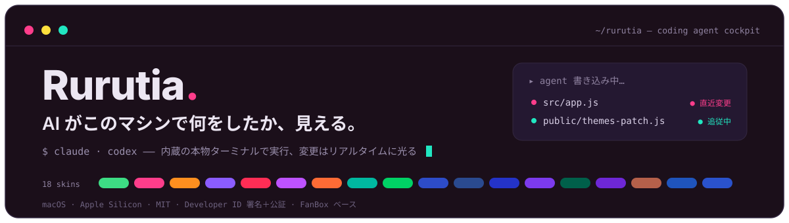
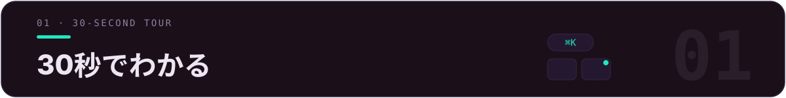
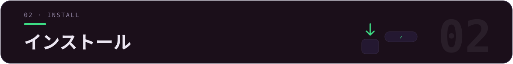
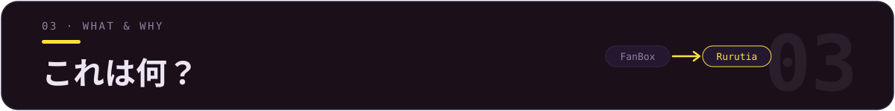
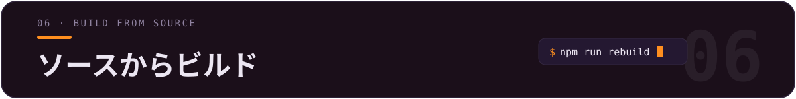
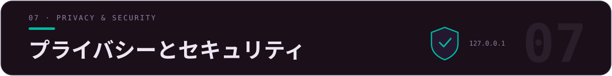
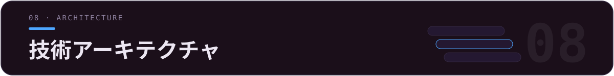

<div align="center">



[](LICENSE)
[](../../releases)
[](../../releases)
[](../../releases)
[](https://github.com/alchaincyf/fanbox)

[简体中文](README.md) · [繁體中文](README.zh-TW.md) · [English](README.en.md) · **日本語** · [한국어](README.ko.md) · [Français](README.fr.md) · [Español](README.es.md)

</div>

<p align="center">
  
</p>
<p align="center"><sub>▲ メイン画面の全体像 —— 同じ画面で、左はダークの「ピクセルライト」、右はライトの「デジタルゼリー」。ファイルグリッドには鮮やかなプロジェクトバッジが付き、サイドバーには Agent プロジェクトと公式使用量がまとまります。</sub></p>

> **✨ 最近のアップデート**：v2.11 観測デッキ（ターミナル作業状況パネル）——タスクのカウントダウン + サブタスク達成のお祝い演出 + 進捗が緑に変わるインタラクション · v2.10 スクリーンショット直行便がツールバーの一等ボタンに格上げ · v2.9 ターミナル配色がスキンに追随 + 20 スロットで自由にカスタマイズ · ラウンド保存でワンクリック復元 · 11 種の coding agent をワンクリック起動 · 上流 FanBox v2.6.2 をマージ。



| やりたいこと | Rurutia では |
|---|---|
| 午後に乱立した 10 個のプロジェクトを取り戻す | `⌘K` のグローバルあいまい検索 · フォルダに node/web/py/rs/go バッジが付き、種類が一目でわかる |
| agent に作業させつつ、何を変えたかも見える | 埋め込みの本物のターミナルで Claude Code / Codex を実行。書き込まれたファイルのカードがその場で光り、プレビューがリアルタイムで追従 |
| 昨日のセッションを再開する | プロジェクトを開いて履歴セッションを確認し、「▶ 再開」ワンクリックで `claude --resume` / `codex resume` がコンテキストを引き継ぐ |
| 公式の使用量を見張って超過を防ぐ | サイドバーに Claude / Codex の 5 時間ウィンドウ + 週次クォータを常時表示。上限に近づくと赤いバー + デスクトップ通知 |
| 気分に合わせて画面全体を着せ替える | 18 種類のカラースキン + 16 種類のターミナルプロンプトテーマで、UI / ターミナル / コードハイライトが一緒に変わる |



**macOS（Apple Silicon / arm64）**

1. [**Releases**](../../releases) から最新の `Rurutia-*.dmg` をダウンロードします。
2. dmg を開き、**Rurutia** を「アプリケーション」にドラッグします。
3. ダブルクリックで開けばすぐ使えます。

> ✅ **Apple Developer ID 証明書による署名 + Apple 公証 + hardened runtime** 済み：ダウンロード後はダブルクリックするだけで使え、「開発元を検証できません」は出ません。



[**FanBox**](https://github.com/alchaincyf/fanbox)（作者：[Huashu（花叔）](https://github.com/alchaincyf)）は、ローカルで動作する「**coding agent のコックピット**」です。ローカルファイルを閲覧／プレビュー／編集しながら、埋め込まれた本物のターミナルで Claude Code、Codex、あるいは任意の coding agent を走らせ、agent がどのファイルを書き換えたかをリアルタイムでハイライトします——**ファイルを見つける → agent を走らせる → 変更を見届ける**、これらすべてを 1 つのウィンドウで完結します。バックエンドは依存ゼロ、データはマシンの外に出ません。

> *「AI は午後の間に 10 個のプロジェクトを立ち上げてくれますが、そのあと二度と見つけられなくなります。FanBox はそれらを取り戻す手助けをします。」*

**Rurutia** は、私が FanBox をベースに作った**個人強化フォーク**です。コア機能は 100% 上流由来で、私はビジュアル／フォント／配色を作り直し、スキンとターミナルプロンプトの 2 つのシステムを追加し、日常の使い勝手を数十か所磨き込みました。


> 4 つのことを軸にしています：**見た目がいい**、**見分けやすい**、**使いやすいターミナル**、**邪魔をしない**。

### 🎨 18 種類のカラースキン

各スキンは「ニュートラルなベース + 3 つの並立するアクセント色 + 一組のセマンティックな状態色」で構成され、本文／アクセント色／バッジの文字／ターミナルの 16 ANSI は**すべて WCAG のコントラスト検証を通過**しています。スキンを 1 つ切り替えると、メイン画面・サイドバー・ターミナル配色・コードハイライト・Monaco の地色が一緒に変わります。ライト 9 種・ダーク 9 種、着想は WeChat 公式アカウント「色所」から得ています。

<p align="center">
  
</p>
<p align="center"><sub>▲ 18 種類のスキン一覧（ライト 9・ダーク 9）。デフォルトは「ピクセルライト」。</sub></p>

UI 全体も同時に現代化しました：ヘアライン罫線、統一されたコーナー半径のリズム、カプセル型セグメントコントロール、控えめなトランジションアニメーション。インターフェース／ファイル名／コード／ターミナルは統一して **Maple Mono CN**（中国語 + 仮名を全字含み、woff2 を内蔵、オフラインでも利用可）を使用します。

### 🚀 ターミナルプロンプト（Starship 内蔵 · 16 種類のテーマ）

開けばすぐ powerline のピル型プロンプト（ディレクトリ / git の状態 / 言語バージョン / 時刻）——**starship を自分でインストールする必要も、`~/.zshrc` を設定する必要もありません**。ZDOTDIR 注入で動作します：まずあなたの本物の dotfile を source し（PATH / エイリアスを寸分違わず再現）、そのうえに starship を重ねます。**この App のターミナルでのみ有効で、いかなる dotfile にも触れず、アンインストールしても残骸ゼロ**です（macOS + zsh）。

<p align="center">
  
</p>
<p align="center"><sub>▲ 16 種類のテーマから 1 つを選択、5 つの修飾を重ねがけ可能。切り替えは即時反映され、実行中のターミナルも Enter を押せば見た目が変わります。</sub></p>

### 🎛 ターミナル配色 · スキンに追随、自分でも選べる

ターミナルの 16 ANSI 色は、もう 18 スキン共通の 1 パレットではありません：青 / マゼンタ / シアンは色相の近いスキンのアクセント色そのものに置き換わり、赤 / 緑 / 黄は意味を保ったまま。`dark-ansi` で Claude Code / Codex を走らせれば、スキンを替えるたびにターミナル内の色も替わります。さらに好みに合わせたいときは：「**ターミナル配色**」パネルの 20 スロットすべてに Claude Code での実際の用途をラベル表示（枠線 / エラー / 成功 / リンクとパス……）。カラーピッカーを開けばすぐ変更でき、開いている全ターミナルへ即反映、スキンごとに別々に記憶されます。ライト 9 種は全体の輝度も下げました（最も明るい面を 64% 未満に抑制）——長時間見つめても目が疲れません。

### 🖥 ターミナル · ブランドアイコン + レインボータブ

<p align="center">
  
</p>
<p align="center"><sub>▲ タブはプロジェクトごとに黄金角で配色、上部バーの公式ブランドアイコンから Claude / Codex / WeChat を直接起動できます。</sub></p>

- **ブランドアイコンツールバー**：Claude Code / Codex / WeChat などの入口は公式ベクターアイコンを使用し、その他のアクションボタンはテーマ色に追従するモノクロのベクターアイコンに描き直しました。
- **レインボータブ**：各ターミナルタブはプロジェクトごとに黄金角で色を取り、複数プロジェクトを並べると自動でずれて一筋のレインボーになります。幅は自動調整され、弾力的にドラッグして並べ替えできます。
- **「普通のターミナル」ボタン**：現在のフォルダでクリーンな shell（agent なし）をワンクリックで開けます。
- **独立した角丸ターミナルカード**：背景が現在のスキンに溶け込み、ダークスキンでも浮いた真っ黒の四角ではなくなりました。

### 🗂 サイドバー · 導線と使用量

<p align="center">
  
</p>

- **クイック入口 / Agent プロジェクトを追加・削除・並べ替え可能**：➕ で追加、ホバーして ✕ で削除、ドラッグで順序をカスタマイズ、すべて永続化されます。
- **使用量パネルの強化**：Claude Code の公式上限（5 時間ウィンドウ / 週次クォータ）を常時表示、取得できないときは理由を明示 + リトライ；上限 85% 以上で赤い警告バー + デスクトップ通知；10 分キャッシュで公式のレート制限に耐えます。

### その他の磨き込み

赤い ✕ = ウィンドウを隠すだけでターミナルは殺さない（⌘Q が本当の終了）· ウィンドウ上部は全体がドラッグ可能 · スクロールバーは細く丸くアクセント色に追従 · デフォルトポートが使用中でも自動で繰り下げ（複数インスタンスでも衝突なし）· カスタムアプリアイコンと logo · **インターフェース言語は 7 言語**（简体中文 / 繁體中文 / English / 日本語 / 한국어 / Français / Español、ユーザーコンテンツ領域は翻訳されません）。


検索とプレビュー、生きた変更ダッシュボード、フォローモード、セッションリプレイ、変更インボックス、Git diff、プロジェクトメモリとワンクリックでのセッション再開、スクリーンショット直行便、AI 整理、リリースウィザード、Skills の俯瞰、ラウンド保存、本物の埋め込みターミナルと 11 種の agent ワンクリック起動、見たまま編集……

<details>
<summary><b>完全な機能一覧を展開</b></summary>

### 🗂 ファイル · 取り戻しとプレビュー
- **⌘K グローバルあいまい検索**：名前の一部を覚えていれば十分です。`⌘↵` でプロジェクトをエディタごと開き、`内容:キーワード` で全文検索に切り替えます。
- **鮮やかなソリッドアイコン**：どのファイルタイプも「それらしい見た目」に——PDF は赤、JS は黄、Markdown は青。写真と動画は実際の比率で表示します。
- **その場でプレビュー**：Markdown レンダリング、HTML のライブ表示、コードの構文ハイライト、画像／動画／PDF のインライン表示（HEIC を含む）、圧縮ファイルの中身一覧。
- **サムネイル高速化**：大きなフォルダでもスクロールとクリックが 0.1 秒以内に収まります。
- **プロジェクトバッジ**：フォルダカードに node / web / py / rs / go を表示します。

### 👀 agent が何を変えたかを見る
- **生きたダッシュボード**：agent がファイルを書くたびに、そのカードがその場で波紋を広げ、変更頻度に応じて発光・呼吸します。
- **フォローモード**：ファイルビュー + プレビューが agent が編集中のファイルに追従します——コードは新しく書かれた行がハイライトされ、HTML はダブルバッファリングでリアルタイムにレンダリングされ白フラッシュが出ません。手動で操作すると即座にコントロールが戻ります。
- **セッションリプレイ**：タイムラインをドラッグして、agent が一歩ずつどのファイルを変えたかを再現します。
- **変更インボックス**：複数のプロジェクトをまたいで、このセッションで変更されたすべてのファイルを集約します。
- **Git 変更 diff**：Monaco の DiffEditor が HEAD と作業ツリーを並べて表示します。

### 🤖 Agent コックピット
- **プロジェクトメモリ**：履歴セッション（あなたの最初の一文がタイトルになります）、各セッションで変更されたファイル、トリガーされた skill。「▶ 再開」ワンクリックでコンテキストを引き継ぎます。
- **スクリーンショット直行便**：システムのスクリーンショットがディスクに保存された瞬間、直通カードが浮かび上がります——agent に渡す、プロジェクトの素材に収める、あるいは注釈を付けてから送る、を選べます。
- **AI 整理**：AI はメタデータだけを見て提案を出し（中身は読みません）、1 項目ずつ確認したうえで実行します。全体を一括で取り消すこともできます。
- **リリースウィザード**：node プロジェクトなら、バージョン番号・CHANGELOG・パッケージング・GitHub Release をワンクリックで一気通貫します。
- **Skills の俯瞰**：マシン上のすべての agent skills を 1 つのビューで——トリガー統計、ヘルスチェック、context 予算、ファイルを消さない有効／無効の切り替え。
- **Agent 使用量**：Claude Code の公式 5 時間ウィンドウ／週次クォータ + ローカルの token 統計。Codex の上限スナップショットも。
- **ラウンド保存（シートベルト）**：agent が各ラウンドの作業前にプロジェクト全体の状態を自動保存します（git 外のプロジェクトはシャドウ git 経由）。ワンクリックで任意のラウンド前へ戻れます。
- **ディスク使用量の俯瞰**：`du` 基準の実使用量を棒グラフでランキング表示し、ドリルダウンできます。

### 🖥 ターミナル · agent を指揮する
- **本物の埋め込みターミナル**：node-pty + xterm.js（WebGL）で、Claude Code / vim / htop を実行しても表示が乱れず、中国語の全角文字も正しく扱います。
- **ファイルをターミナルにドラッグ**：パスを自動挿入して agent にコンテキストとして渡します。
- **クリックできるパス**：スペースを含む名前、中国語名、折り返した長いパスもすべて認識します。
- **選択してターミナルへ放り込む**：プレビューで一節のテキストを選ぶと、「出典ファイル + フェンス」形式でターミナルに送られます。
- **状況把握**：タブのドットが実行中／待機中／終了を表示します。あなたの番になるとターミナルの縁が呼吸して知らせ、長いタスクが完了するとシステム通知が届きます。
- **11 種の coding agent をワンクリック起動**：内蔵レジストリ（Claude Code / Codex / Hermes / Kimi / opencode……）、未インストールのものはワンクリックでインストールコマンドをコピー、config.json でカスタマイズできます。
- **更新カプセル**：新バージョンがあるとトップバーに浮かび上がり、ワンクリックで dmg をダウンロードできます。

### ✍️ 編集 · 見たまま編集
- **Markdown**：Milkdown Crepe（Notion ふう）、入力を止めて 0.8 秒で自動保存します。
- **コード／JSON**：Monaco（VS Code と同じコア）。
- **画像注釈**：ブラシ／矢印／テキスト／墨消し、フォーマット変換、圧縮。
- **未保存ガード**：3 種類のエディタが、未保存のまま終了しようとするのを統一的にブロックします。

オリジナルの英語版説明は [`README.fanbox.md`](README.fanbox.md) を参照してください。

</details>



```bash
npm install
npm run rebuild        # node-pty を Electron の ABI に合わせて再ビルド

# 未署名のローカルビルド（自分用）：
CSC_IDENTITY_AUTO_DISCOVERY=false npx electron-builder --mac --dir -c.mac.identity=null
# 成果物：dist/mac-arm64/Rurutia.app
```

変更は**追加式パッチ**として構成しています（`ui-patch.css` / `themes-patch.js` / `prompt-patch.js` などの新規ファイル + 少数の上流ファイル編集）。上流が新版を出したあとに `git rebase` で再適用しやすくするためです——完全な一覧と適用手順は [`RURUTIA-PATCH.md`](RURUTIA-PATCH.md) を参照してください。



> 上流の FanBox と一貫しており、Rurutia はそのセキュリティモデルを変えません。

- バックエンドはローカルのループバックアドレスでのみリッスンし、Host ヘッダーを検証します。**データはマシンの外に出ません**。
- フロントエンド資産（レンダラー、フォント、starship バイナリ）はすべてローカルに内蔵されており、**オフラインでも完全に利用できます**。唯一の外向き通信は Claude / Codex の使用量 API（任意）と GitHub の更新チェックです。
- HTML プレビューは origin を分離したサンドボックス iframe 内でレンダリングされ、ターミナルの機能には触れられません。
- プロンプトは ZDOTDIR 注入で動作し、**いかなる dotfile も書き込まず・変更せず**、アンインストールしても残骸ゼロです。
- 設定はアトミック書き込み（temp + fsync + rename）で行い、削除はシステムのゴミ箱を経由します（復元可能）。



| レイヤー | 使っているもの |
|---|---|
| バックエンド | 依存ゼロの Node.js `server.js`（ファイル API + 静的配信 + サムネイル） |
| デスクトップシェル | Electron 33 + node-pty（asarUnpack なネイティブモジュール） |
| ターミナル | xterm.js + WebGL + unicode11 |
| プロンプト | 内蔵 starship（署名・公証済み）+ Nerd Font、ZDOTDIR ランタイム注入 |
| エディタ | Monaco（コード）+ Milkdown Crepe（Markdown） |
| フォント | Maple Mono CN（woff2 を内蔵） |
| パッケージング | electron-builder → 署名 + 公証済みの arm64 `.dmg` |


- コアアプリ **FanBox** は **[Huashu（花叔）](https://github.com/alchaincyf)**（[alchaincyf/fanbox](https://github.com/alchaincyf/fanbox)）が開発し、MIT ライセンスです。Rurutia はその個人強化フォークで、同じ [MIT ライセンス](LICENSE) に従います。上流の依存関係の完全な一覧は [`README.fanbox.md`](README.fanbox.md) を参照してください。
- フォント **Maple Mono** は [subframe7536/maple-font](https://github.com/subframe7536/maple-font)（OFL）由来です。
- ターミナルプロンプト **Starship** は [starship/starship](https://github.com/starship/starship)（ISC）由来です。
- 配色の着想は WeChat 公式アカウント「**色所**」の上質な配色コレクションから得ています。

<div align="center">
<br>

**Finder** はファイルを管理してくれます。**IDE** はコードを書く手助けをしてくれます。**Rurutia / FanBox** は、AI があなたのマシンで何をしたかを見える化してくれます。

MIT License © Rurutia · [Huashu（花叔）の FanBox](https://github.com/alchaincyf/fanbox) をベースに

</div>
