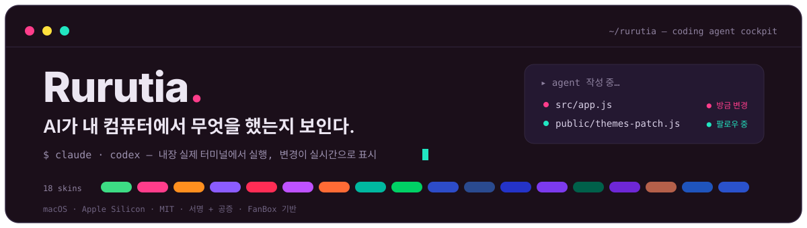
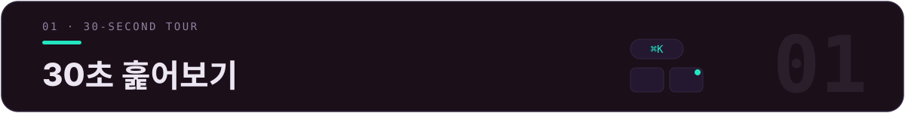
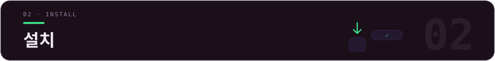
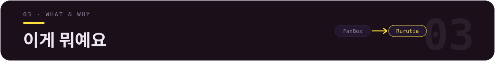
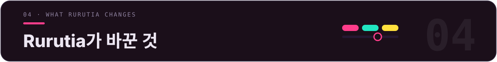
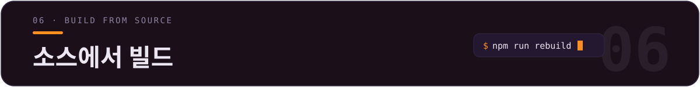
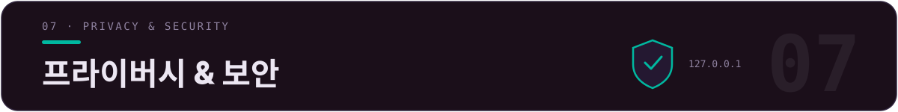
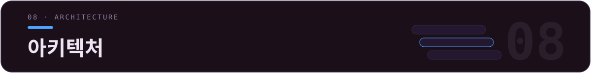

<div align="center">



[](LICENSE)
[](../../releases)
[](../../releases)
[](../../releases)
[](https://github.com/alchaincyf/fanbox)

[简体中文](README.md) · [繁體中文](README.zh-TW.md) · [English](README.en.md) · [日本語](README.ja.md) · **한국어** · [Français](README.fr.md) · [Español](README.es.md)

</div>

<p align="center">
  
</p>
<p align="center"><sub>▲ 메인 화면 개요 —— 같은 화면, 왼쪽은 다크 「픽셀 라이트」, 오른쪽은 라이트 「디지털 젤리」. 파일 그리드에는 선명한 컬러 프로젝트 배지가 붙고, 사이드바는 Agent 프로젝트와 공식 사용량을 모아 보여줍니다.</sub></p>

> **✨ 최근 업데이트**: v2.11 옵저버 캡슐(터미널 작업 상태 패널) —— 작업 카운트다운 + 서브태스크 축하 + 진행률 초록 전환 인터랙션 · v2.10 스크린샷 다이렉트가 툴바 1등급 버튼으로 업그레이드 · v2.9 터미널 색상이 스킨을 따라감 + 20개 슬롯 커스텀 · 라운드 스냅샷 원클릭 롤백 · 코딩 에이전트 11종 원클릭 실행 · 업스트림 FanBox v2.6.2 병합.



| 하고 싶은 것 | Rurutia에서는 |
|---|---|
| 한나절 만에 마구 만든 프로젝트 열 개 되찾기 | `⌘K` 전역 퍼지 검색 · 폴더에 node/web/py/rs/go 배지를 달아 타입을 한눈에 식별 |
| agent에게 일을 시키면서, 무엇을 고쳤는지도 분명히 확인하기 | 내장된 진짜 터미널에서 Claude Code / Codex 실행; 어느 파일을 쓰면 그 카드가 즉시 빛나고 미리보기가 실시간으로 따라옴 |
| 어제 세션 이어가기 | 프로젝트를 열어 지난 세션을 보고, 「▶ 이어가기」 한 번으로 `claude --resume` / `codex resume`로 컨텍스트 복귀 |
| 공식 사용량을 주시하며 한도 초과 막기 | 사이드바에 Claude / Codex의 5시간 윈도우 + 주간 할당량을 상시 표시, 한도에 근접하면 빨간 막대 + 데스크톱 알림 |
| 기분에 따라 전체 화면 갈아입히기 | 18종 컬러 스킨 + 16종 터미널 프롬프트 테마, UI / 터미널 / 코드 하이라이트가 함께 변경 |



**macOS(Apple Silicon / arm64)**

1. [**Releases**](../../releases)에서 최신 `Rurutia-*.dmg`를 다운로드하세요.
2. dmg를 열고 **Rurutia**를 「응용 프로그램」으로 끌어다 놓으세요.
3. 더블클릭해서 열면 바로 사용할 수 있습니다.

> ✅ **Apple Developer ID 인증서 서명 + Apple 공증 + hardened runtime**을 적용했습니다: 다운로드 후 더블클릭하면 바로 사용할 수 있고, 「개발자를 확인할 수 없음」 경고가 뜨지 않습니다.



[**FanBox**](https://github.com/alchaincyf/fanbox)(제작: [花叔](https://github.com/alchaincyf))는 로컬에서 실행되는 「**coding agent 콕핏**」입니다: 로컬 파일을 탐색 / 미리보기 / 편집하는 동시에, 내장된 진짜 터미널에서 Claude Code, Codex 또는 어떤 coding agent든 실행할 수 있습니다 —— agent가 어느 파일을 고치면 실시간으로 하이라이트되고, **파일 되찾기 → agent 실행 → 변경 확인**이 한 창에서 끝납니다. 무의존 백엔드, 데이터는 로컬을 벗어나지 않습니다.

> *"AI가 한나절 만에 프로젝트 열 개를 만들어 주고, 그다음엔 다시는 찾을 수 없게 됩니다. FanBox는 그걸 되찾아 줍니다."*

**Rurutia**는 제가 FanBox를 기반으로 만든 **개인 강화 분기**입니다: 핵심 기능은 100% 상류(upstream)에서 왔고, 저는 비주얼 / 폰트 / 컬러를 다시 만들고, 스킨과 터미널 프롬프트 두 시스템을 추가했으며, 일상적인 편의성을 수십 군데 다듬었습니다.



> 네 가지에 집중했습니다: **보기 좋게**, **알아보기 쉽게**, **쓰기 좋은 터미널**, **방해 줄이기**.

### 🎨 18종 컬러 스킨

각 스킨은 「중성 바탕 + 나란한 강조색 3개 + 한 벌의 시맨틱 상태색」으로 구성되며, 본문 / 강조색 / 배지 글자 / 터미널 16 ANSI **모두 WCAG 대비 검증을 통과**합니다; 스킨을 전환하면 메인 화면, 사이드바, 터미널 색상, 코드 하이라이트, Monaco 배경색이 함께 바뀝니다. 라이트 9종 다크 9종, 영감은 WeChat 공식 계정 「色所」에서 얻었습니다.

<p align="center">
  
</p>
<p align="center"><sub>▲ 18종 스킨 개요(라이트 9종 다크 9종). 기본값은 「픽셀 라이트」.</sub></p>

전체 UI도 함께 현대화했습니다: 헤어라인 보더, 통일된 라운드 코너 리듬, 캡슐형 세그먼트 컨트롤, 절제된 전환 애니메이션; 인터페이스 / 파일명 / 코드 / 터미널은 **Maple Mono CN**으로 통일했습니다(중국어 + 가나 전체 문자, woff2 내장, 오프라인 사용 가능).

### 🚀 터미널 프롬프트(Starship 내장 · 16종 테마)

설치 후 바로 powerline 알약 모양 프롬프트(디렉터리 / git 상태 / 언어 버전 / 시간)를 사용할 수 있습니다 —— **starship을 따로 설치할 필요도, `~/.zshrc`를 설정할 필요도 없습니다**. ZDOTDIR 주입 방식: 먼저 당신의 실제 dotfile을 source하고(PATH / 별칭이 한 치의 오차도 없이 유지됨), 그 위에 starship을 얹습니다; **이 App 터미널에서만 적용되고, 어떤 dotfile도 건드리지 않으며, 제거 시 잔여물이 전혀 없습니다**(macOS + zsh).

<p align="center">
  
</p>
<p align="center"><sub>▲ 16종 테마 중 하나 선택 + 5종 보정 중첩 적용 가능; 전환은 즉시 적용되며, 실행 중인 터미널은 엔터를 누르면 모습이 바뀝니다.</sub></p>

### 🎛 터미널 색상 · 스킨을 따라가고, 직접 고를 수도

터미널 16 ANSI는 더 이상 18종 스킨이 공유하는 한 팔레트가 아닙니다: 파랑 / 마젠타 / 시안은 색상이 가까운 해당 스킨의 강조색 본연의 색으로 바뀌고, 빨강 / 초록 / 노랑은 의미를 유지합니다; `dark-ansi`로 Claude Code / Codex를 돌리면 스킨을 바꿀 때마다 터미널 UI 색도 함께 바뀝니다. 더 취향대로 하고 싶다면: 「**터미널 색상**」 패널의 20개 슬롯 전부에 Claude Code에서의 실제 용도가 표기되어 있고(테두리 / 오류 / 성공 / 링크 경로…), 컬러 피커를 열어 바로 바꾸면 모든 터미널이 즉시 반영되며, 스킨별로 따로 기억됩니다. 라이트 9종은 전체 밝기를 낮췄습니다(가장 밝은 표면을 64% 미만으로) —— 오래 봐도 눈이 부시지 않습니다.

### 🖥 터미널 · 브랜드 아이콘 + 레인보우 탭

<p align="center">
  
</p>
<p align="center"><sub>▲ 탭은 프로젝트별 황금각 배색, 상단 바의 공식 브랜드 아이콘으로 Claude / Codex / WeChat을 바로 실행할 수 있습니다.</sub></p>

- **브랜드 아이콘 툴바**: Claude Code / Codex / WeChat 등 실행 진입점은 공식 벡터 아이콘을 사용하고, 나머지 동작 버튼은 테마색을 따르는 단색 벡터로 다시 그렸습니다.
- **레인보우 탭**: 각 터미널 탭은 프로젝트별 황금각으로 색을 정해, 여러 프로젝트가 나란히 있으면 자동으로 어긋나 한 줄기 무지개를 이룹니다; 너비는 자동 조정되고 탄력적으로 드래그해 위치를 바꿀 수 있습니다.
- **「일반 터미널」 버튼**: 한 번의 클릭으로 현재 폴더에 깨끗한 셸(agent 없이)을 엽니다.
- **독립된 라운드 코너 터미널 카드**: 배경이 현재 스킨에 녹아들어, 다크 스킨에서 더 이상 튀는 새까만 사각형이 아닙니다.

### 🗂 사이드바 · 진입점과 사용량

<p align="center">
  
</p>

- **빠른 진입점 / Agent 프로젝트 추가·정렬 가능**: ➕로 추가, 마우스를 올려 ✕로 제거, 드래그로 순서를 정할 수 있으며 모두 영속 저장됩니다.
- **사용량 패널 강화**: Claude Code 공식 한도(5시간 윈도우 / 주간 할당량)를 항상 표시하고, 가져오지 못하면 이유를 명시 + 재시도합니다; 85% 이상이면 빨간 경고 막대 + 데스크톱 알림; 10분 캐시로 공식 속도 제한에도 버팁니다.

### 그 밖의 다듬기

빨간 ✕ 클릭 = 터미널을 죽이지 않고 창만 숨김(⌘Q가 진짜 종료) · 창 상단 전체 드래그 가능 · 가늘고 둥근 스크롤바가 강조색을 따라감 · 기본 포트가 사용 중이면 자동으로 다음 포트로 넘어감(여러 인스턴스 충돌 없음) · 커스텀 앱 아이콘과 logo · **인터페이스 언어 7종**(简体中文 / 繁體中文 / English / 日本語 / 한국어 / Français / Español, 사용자 콘텐츠 영역은 번역하지 않음).


검색과 미리보기, 살아있는 변경 대시보드, 팔로우 모드, 세션 리플레이, 변경 수신함, Git diff, 프로젝트 메모리와 원클릭 세션 이어가기, 스크린샷 다이렉트, AI 정리, 릴리스 마법사, Skills 살펴보기, 라운드 스냅샷, 진짜 내장 터미널과 11개 agent 원클릭 실행, 보이는 그대로 편집……

<details>
<summary><b>전체 기능 목록 펼치기</b></summary>

### 🗂 파일 · 되찾기와 미리보기
- **⌘K 전역 퍼지 검색**: 이름 일부만 기억하면 됩니다; `⌘↵`로 에디터에서 프로젝트를 통째로 열기; `内容:키워드`로 전문 검색 전환.
- **선명한 컬러 실물 아이콘**: 모든 파일이 「자기 자신처럼 보입니다」 —— PDF는 빨강, JS는 노랑, Markdown은 파랑; 사진과 영상은 실제 비율로 표시됩니다.
- **제자리 미리보기**: Markdown 렌더링, HTML 실시간 완성본, 코드 구문 강조, 이미지/영상/PDF 내장(HEIC 포함), 압축 파일 목록.
- **썸네일 가속**: 큰 폴더에서도 스크롤과 클릭이 0.1초 이내.
- **프로젝트 배지**: 폴더 카드에 node / web / py / rs / go를 표시합니다.

### 👀 agent가 무엇을 고쳤는지 보기
- **살아있는 대시보드**: agent가 파일을 하나씩 쓸 때마다 그 카드가 즉시 물결을 일으키고, 변경 빈도에 따라 빛을 내며 호흡하듯 깜빡입니다.
- **팔로우 모드**: 파일 뷰 + 미리보기가 agent가 편집 중인 파일을 추적합니다 —— 코드는 새로 쓰인 줄을 따라 하이라이트되고, HTML은 더블 버퍼링으로 실시간 렌더링되어 흰 화면 깜빡임이 없습니다; 직접 둘러보면 즉시 제어권이 돌아옵니다.
- **세션 리플레이**: 타임라인을 드래그해 agent가 단계별로 어떤 파일을 고쳤는지 재현합니다.
- **변경 사항 수신함**: 여러 프로젝트에 걸쳐 이번 세션에서 변경된 모든 파일을 모아 봅니다.
- **Git 변경 diff**: Monaco DiffEditor로 HEAD와 작업 트리를 나란히 표시합니다.

### 🤖 Agent 콕핏
- **프로젝트 메모리**: 지난 세션(당신의 첫 문장이 제목), 매번 고친 파일, 트리거된 skill; 「▶ 이어가기」 한 번으로 컨텍스트 복귀.
- **스크린샷 다이렉트**: 시스템 스크린샷이 저장되는 즉시 다이렉트 카드가 떠오릅니다 —— agent에게 전달하거나, 프로젝트 소재로 담거나, 주석을 단 뒤 보낼 수 있습니다.
- **AI 정리**: AI는 메타데이터만 보고 제안을 내고(내용을 읽지 않음), 한 건씩 사람이 검토한 뒤 실행 + 전체 되돌리기가 가능합니다.
- **릴리스 마법사**: node 프로젝트에서 버전 번호, CHANGELOG, 패키징, GitHub Release를 한 번에 엮어 줍니다.
- **Skills 살펴보기**: 로컬의 모든 agent skill을 한 화면에 —— 트리거 통계, 헬스 체크, context 예산, 파일을 지우지 않는 켜기/끄기.
- **Agent 사용량**: Claude Code 공식 5시간 윈도우/주간 할당량 + 로컬 token 통계; Codex 한도 스냅샷.
- **라운드 스냅샷(안전벨트)**: agent가 매 라운드 시작 전 프로젝트 전체 상태를 자동 저장(git이 아닌 프로젝트는 섀도 git 사용), 원클릭으로 어느 라운드 이전으로든 복원.
- **디스크 사용량 살펴보기**: `du` 기준의 실제 사용량 막대 순위, 드릴다운 가능.

### 🖥 터미널 · agent 지휘
- **진짜 내장 터미널**: node-pty + xterm.js(WebGL), Claude Code / vim / htop를 실행해도 화면이 깨지지 않고, 한중일 전각 문자도 정확합니다.
- **파일을 터미널로 드래그**: 경로가 자동으로 삽입되어 agent에 컨텍스트로 전달됩니다.
- **클릭 가능한 경로**: 공백이 포함된 이름, 한자 이름, 줄바꿈된 긴 경로도 인식합니다.
- **선택만 하면 터미널로 전송**: 미리보기에서 텍스트를 선택하면 「파일 출처 + 코드 펜스」 형식으로 터미널에 보냅니다.
- **상황 인식**: 탭의 동그란 점이 실행/대기/종료 상태를 표시; 당신 차례가 되면 터미널 가장자리가 호흡하듯 알리고, 긴 작업이 끝나면 시스템 알림을 보냅니다.
- **코딩 에이전트 11종 원클릭 실행**: 내장 레지스트리(Claude Code / Codex / Hermes / Kimi / opencode…), 미설치는 원클릭으로 설치 명령 복사, config.json으로 커스텀 가능.
- **업데이트 캡슐**: 새 버전이 나오면 상단 바에 떠서 원클릭으로 dmg 다운로드.

### ✍️ 편집 · 보이는 그대로(WYSIWYG)
- **Markdown**: Milkdown Crepe(Notion 스타일), 입력을 멈춘 지 0.8초 후 자동 저장.
- **코드/JSON**: Monaco(VS Code와 동일한 코어).
- **이미지 주석**: 펜/화살표/텍스트/모자이크, 포맷 변환, 압축.
- **미저장 가드**: 세 가지 에디터 모두 저장하지 않은 채 나가는 것을 차단합니다.

원본 영문 설명은 [`README.fanbox.md`](README.fanbox.md)를 참고하세요.

</details>



```bash
npm install
npm run rebuild        # node-pty를 Electron ABI에 맞춰 재빌드

# 미서명 로컬 빌드(개인용):
CSC_IDENTITY_AUTO_DISCOVERY=false npx electron-builder --mac --dir -c.mac.identity=null
# 산출물: dist/mac-arm64/Rurutia.app
```

변경 사항은 **추가 방식 패치**로 구성됩니다(`ui-patch.css` / `themes-patch.js` / `prompt-patch.js` 등 새로 추가한 파일 + 소수의 상류 파일 편집), 상류에 새 버전이 나온 뒤 `git rebase`로 다시 적용하기 쉽습니다 —— 전체 목록과 적용 절차는 [`RURUTIA-PATCH.md`](RURUTIA-PATCH.md)를 참고하세요.



> 상류 FanBox와 동일하게, Rurutia는 그 보안 모델을 바꾸지 않습니다.

- 백엔드는 로컬 루프백 주소에서만 수신하고 Host 헤더를 검증하여, **데이터는 로컬을 벗어나지 않습니다**.
- 프런트엔드 리소스(렌더러, 폰트, starship 바이너리)가 모두 로컬에 내장되어 **오프라인에서 완전히 사용 가능**합니다; 유일한 외부 네트워크 요청은 Claude / Codex 사용량 API(선택)와 GitHub 업데이트 확인입니다.
- HTML 미리보기는 origin이 격리된 샌드박스 iframe 안에서 렌더링되어 터미널 기능에 접근할 수 없습니다.
- 프롬프트는 ZDOTDIR 주입 방식으로, **어떤 dotfile도 쓰거나 고치지 않으며**, 제거 시 잔여물이 전혀 없습니다.
- 설정은 원자적 쓰기(temp + fsync + rename); 삭제는 시스템 휴지통을 거칩니다(복구 가능).



| 레이어 | 사용 기술 |
|---|---|
| 백엔드 | 무의존 Node.js `server.js`(파일 API + 정적 서비스 + 썸네일) |
| 데스크톱 셸 | Electron 33 + node-pty(asarUnpack 네이티브 모듈) |
| 터미널 | xterm.js + WebGL + unicode11 |
| 프롬프트 | 내장 starship(서명·공증됨) + Nerd Font, ZDOTDIR 런타임 주입 |
| 에디터 | Monaco(코드) + Milkdown Crepe(Markdown) |
| 폰트 | Maple Mono CN(woff2 내장) |
| 패키징 | electron-builder → 서명 + 공증된 arm64 `.dmg` |


- 핵심 애플리케이션 **FanBox**는 **[花叔](https://github.com/alchaincyf)**([alchaincyf/fanbox](https://github.com/alchaincyf/fanbox))가 개발했으며, MIT 라이선스입니다. Rurutia는 그 개인 강화 분기로, 동일한 [MIT 라이선스](LICENSE)를 따릅니다. 전체 상류 의존성 목록은 [`README.fanbox.md`](README.fanbox.md)를 참고하세요.
- 폰트 **Maple Mono**는 [subframe7536/maple-font](https://github.com/subframe7536/maple-font)(OFL)에서 가져왔습니다.
- 터미널 프롬프트 **Starship**은 [starship/starship](https://github.com/starship/starship)(ISC)에서 가져왔습니다.
- 컬러 영감은 WeChat 공식 계정 「**色所**」의 고급스러운 컬러 모음에서 얻었습니다.

<div align="center">
<br>

**Finder**는 파일을 관리해 줍니다. **IDE**는 코드를 작성하게 해 줍니다. **Rurutia / FanBox**는 AI가 당신의 머신에서 무엇을 했는지 분명히 보여 줍니다.

MIT License © Rurutia · [花叔 Huashu의 FanBox](https://github.com/alchaincyf/fanbox) 기반

</div>
