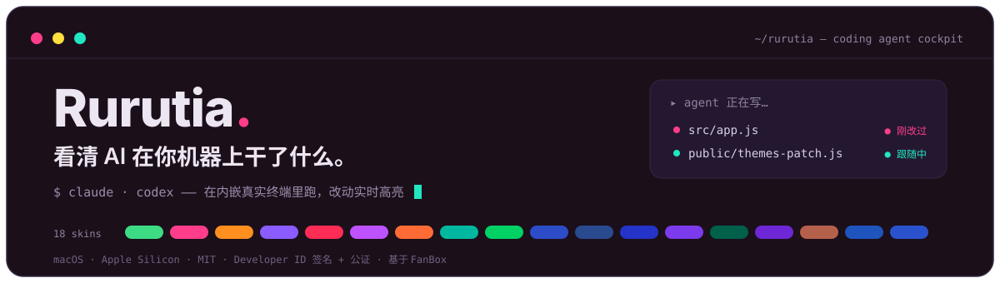
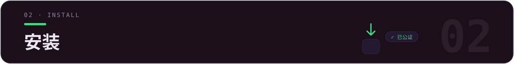

<div align="center">



[](LICENSE)
[](../../releases)
[](../../releases)
[](../../releases)
[](https://github.com/alchaincyf/fanbox)

**简体中文** · [繁體中文](README.zh-TW.md) · [English](README.en.md) · [日本語](README.ja.md) · [한국어](README.ko.md) · [Français](README.fr.md) · [Español](README.es.md)

</div>

<p align="center">
  
</p>
<p align="center"><sub>▲ 主界面总览 —— 同一界面、左深「像素光」右浅「数字果冻」。文件网格带强色项目徽章，侧栏汇总 Agent 项目与官方用量。</sub></p>

> **✨ 最近更新**：v2.11 观察舱（终端工作状态面板）——任务倒数 + 子任务庆祝 + 进度翻绿互动 · v2.10 截图直通升级工具条一等按钮 · v2.9 终端配色跟随皮肤 + 20 槽位自选 · 回合存档一键回滚 · 11 个 coding agent 一键启动 · 合并上游 FanBox v2.6.2。


| 你想做的事 | 在 Rurutia 里 |
|---|---|
| 找回一个下午乱起的十个项目 | `⌘K` 全局模糊搜索 · 文件夹标 node/web/py/rs/go 徽章一眼认出类型 |
| 让 agent 干活、还能看清它改了啥 | 内嵌真实终端跑 Claude Code / Codex；它写哪个文件，那张卡片当场发光、预览实时跟随 |
| 续上昨天的会话 | 点开项目看历史会话，「▶ 续上」一键 `claude --resume` / `codex resume` 接回上下文 |
| 盯住官方用量别超额 | 侧栏常显 Claude / Codex 的 5h 窗口 + 周配额，接近上限红条 + 桌面通知 |
| 让整个界面随心情换装 | 18 套配色皮肤 + 16 套终端提示符主题，UI / 终端 / 代码高亮一起变 |



**macOS（Apple Silicon / arm64）**

1. 到 [**Releases**](../../releases) 下载最新 `Rurutia-*.dmg`。
2. 打开 dmg，把 **Rurutia** 拖进「应用程序」。
3. 双击打开即可使用。

> ✅ 已用 **Apple Developer ID 证书签名 + Apple 公证 + hardened runtime**：下载后双击直接用，不会弹「无法验证开发者」。


[**FanBox**](https://github.com/alchaincyf/fanbox)（作者：[花叔](https://github.com/alchaincyf)）是一个本地运行的「**coding agent 驾驶舱**」：一边浏览 / 预览 / 编辑本地文件，一边在内嵌真实终端里跑 Claude Code、Codex 或任何 coding agent——agent 改了哪个文件实时高亮，**找回文件 → 运行 agent → 看清改动**在一个窗口完成。零依赖后端，数据不出本机。

> *"AI 帮你一个下午起十个项目，然后它们就再也找不到了。FanBox 帮你把它们找回来。"*

**Rurutia** 是我在 FanBox 基础上做的**个人增强分支**：核心能力 100% 来自上游，我重做了视觉 / 字体 / 配色，加了皮肤与终端提示符两套系统，并打磨了几十处日常顺手度。


> 围绕四件事：**好看、好认、好用的终端、少打扰**。

### 🎨 18 套配色皮肤

每套是「中性底 + 3 个并列强调色 + 一组语义状态色」，正文 / 强调色 / 徽章字 / 终端 16 ANSI **全部过 WCAG 对比度校验**；切一套皮肤，主界面、侧栏、终端配色、代码高亮、Monaco 底色一起换。9 浅 9 深，灵感来自公众号「色所」。

<p align="center">
  
</p>
<p align="center"><sub>▲ 18 套皮肤总览（9 浅 9 深）。默认「像素光」。</sub></p>

整体 UI 同步现代化：发丝边框、统一圆角节奏、胶囊分段控件、克制的过渡动效；界面 / 文件名 / 代码 / 终端统一 **Maple Mono CN**（中文 + 假名全字符，内嵌 woff2，离线可用）。

### 🚀 终端提示符（自带 Starship · 16 套主题）

开箱即是 powerline 药丸提示符（目录 / git 状态 / 语言版本 / 时间）——**不用装 starship、不用配 `~/.zshrc`**。走 ZDOTDIR 注入：先 source 你真实的 dotfile（PATH / 别名分毫不差），再叠加 starship；**只在本 App 终端生效、不碰任何 dotfile、卸载零残留**（macOS + zsh）。

<p align="center">
  
</p>
<p align="center"><sub>▲ 16 套主题任选一 + 5 个修饰可叠加；切换即时生效，正在跑的终端按回车就变样。</sub></p>

### 🎛 终端配色 · 跟皮肤走，还能自己选

终端 16 ANSI 不再是 18 套皮肤共用一副：蓝 / 品红 / 青按色相就近换成该皮肤的强调色本尊，红 / 绿 / 黄保住语义；`dark-ansi` 下跑 Claude Code / Codex，换皮肤终端界面色跟着换。想更个性化：「**终端配色**」面板 20 个槽位全按 Claude Code 实际用途标注（框线 / 错误 / 成功 / 链接路径…），取色器点开即改、所有终端即时变色、每套皮肤分开记忆。浅色 9 套整体降亮度（最亮表面压到 64% 以下）——长时间盯着不刺眼。

### 🖥 终端 · 品牌图标 + 彩虹标签

<p align="center">
  
</p>
<p align="center"><sub>▲ 标签按项目黄金角配色，顶栏官方品牌图标直接启动 Claude / Codex / 微信。</sub></p>

- **品牌图标工具栏**：Claude Code / Codex / 微信 等入口用官方矢量图标，其余动作按钮重绘为跟随主题色的单色矢量。
- **彩虹标签**：每个终端标签按项目黄金角取色，多项目并排自动错开成一道彩虹；宽度自适应、可弹性拖拽换位。
- **「普通终端」按钮**：一键在当前文件夹开个干净 shell（不带 agent）。
- **独立圆角终端卡**：背景融入当前皮肤，深色下不再是突兀的纯黑方块。

### 🗂 侧栏 · 入口与用量

<p align="center">
  
</p>

- **快速入口 / Agent 项目可增删可排序**：➕ 加入、悬停 ✕ 移除、拖拽自定义顺序，全部持久化。
- **用量面板增强**：Claude Code 官方限额（5h 窗口 / 周配额）恒显，取不到写明原因 + 重试；≥85% 红色警告条 + 桌面通知；10 分钟缓存扛住官方限流。

### 其余打磨

点红 ✕ = 隐藏窗口而非杀终端（⌘Q 才真退）· 窗口顶部整条可拖拽 · 滚动条细圆跟随强调色 · 默认端口被占自动顺延（多实例不冲突）· 自定义应用图标与 logo · **界面语言 7 种**（简中 / 繁中 / EN / 日 / 韩 / 法 / 西，用户内容区不翻译）。


搜索与预览、活的改动仪表盘、跟随模式、会话回放、变更收件箱、Git diff、项目记忆与一键续会话、截图直通车、AI 整理、发版向导、Skills 透视、回合存档、真实内嵌终端与 11 个 agent 一键启动、所见即所得编辑……

<details>
<summary><b>展开完整功能清单</b></summary>

### 🗂 文件 · 找回与预览
- **⌘K 全局模糊搜索**：记得名字片段就行；`⌘↵` 用编辑器整包打开项目；`内容:关键词` 切全文搜索。
- **强色实体图标**：每种文件「长得像它自己」——PDF 红、JS 黄、Markdown 蓝；照片视频按真实比例呈现。
- **原地预览**：Markdown 渲染、HTML 实时成品、代码语法高亮、图片/视频/PDF 内嵌（含 HEIC）、压缩包清单。
- **缩略图加速**：大文件夹滚动和点击都在 0.1 秒内。
- **项目徽章**：文件夹卡片标 node / web / py / rs / go。

### 👀 看 agent 改了什么
- **活的仪表盘**：agent 每写一个文件，那张卡片当场荡开涟漪、按改动频率发光呼吸。
- **跟随模式**：文件视图 + 预览跟踪 agent 正在编辑的文件——代码随新写行高亮，HTML 双缓冲实时渲染零白闪；手动浏览立即交还控制权。
- **会话回放**：拖时间轴重现 agent 一步步改了哪些文件。
- **变更收件箱**：跨项目汇总本会话所有被改动的文件。
- **Git 改动 diff**：Monaco DiffEditor 并排 HEAD vs 工作区。

### 🤖 Agent 驾驶舱
- **项目记忆**：历史会话（你的第一句话当标题）、每次改过的文件、触发过的 skill；「▶ 续上」一键接回上下文。
- **截图直通车**：系统截屏落盘即浮出直通卡——喂给 agent、收进项目素材、或标注后再发。
- **AI 整理**：AI 只看元数据出提案（不读内容），逐条过人后执行 + 可整体撤销。
- **发版向导**：node 项目一键串起版本号、CHANGELOG、打包、GitHub Release。
- **Skills 透视**：本机全部 agent skills 一个视图——触发统计、健康检查、context 预算、不删文件的启停。
- **Agent 用量**：Claude Code 官方 5h 窗口/周配额 + 本地 token 统计；Codex 限额快照。
- **回合存档（安全带）**：agent 每轮开工前自动存完整项目状态（非 git 项目走影子 git），一键回到任意一轮之前。
- **磁盘占用透视**：`du` 口径真实占用条形榜，可下钻。

### 🖥 终端 · 指挥 agent
- **真实内嵌终端**：node-pty + xterm.js（WebGL），跑 Claude Code / vim / htop 不花屏，中文宽字符正确。
- **拖文件进终端**：自动插入路径喂给 agent 当上下文。
- **路径可点击**：带空格、中文名、折行长路径都能识别。
- **选中即甩给终端**：预览里选一段文字，以「文件出处 + 围栏」格式发进终端。
- **态势感知**：标签圆点显示运行/空闲/退出；轮到你时终端边缘呼吸提示，长任务完成发系统通知。
- **11 个 coding agent 一键启动**：内置注册表（Claude Code / Codex / Hermes / Kimi / opencode…），未装的一键复制安装命令，config.json 可自定义。
- **更新胶囊**：有新版本时顶栏浮出，一键下载 dmg。

### ✍️ 编辑 · 所见即所得
- **Markdown**：Milkdown Crepe（Notion 式），停笔 0.8 秒自动保存。
- **代码/JSON**：Monaco（VS Code 同款内核）。
- **图片标注**：画笔/箭头/文字/打码、格式转换、压缩。
- **未保存守卫**：三种编辑器统一拦截未保存退出。

原始英文版说明见 [`README.fanbox.md`](README.fanbox.md)。

</details>


```bash
npm install
npm run rebuild        # 把 node-pty 重编到 Electron 的 ABI

# 未签名本地构建（自己用）：
CSC_IDENTITY_AUTO_DISCOVERY=false npx electron-builder --mac --dir -c.mac.identity=null
# 产物：dist/mac-arm64/Rurutia.app
```

改动以**追加式补丁**组织（`ui-patch.css` / `themes-patch.js` / `prompt-patch.js` 等新增文件 + 少量上游文件编辑），方便上游出新版后 `git rebase` 重新套用——完整清单与套用步骤见 [`RURUTIA-PATCH.md`](RURUTIA-PATCH.md)。


> 与上游 FanBox 一致，Rurutia 不改变其安全模型。

- 后端只在本机回环地址监听 + 校验 Host 头，**数据不出本机**。
- 前端资源（渲染器、字体、starship 二进制）全部本地内置，**离线完全可用**；仅有的出网请求是 Claude / Codex 用量接口（可选）与 GitHub 更新检查。
- HTML 预览在隔离 origin 的沙箱 iframe 里渲染，碰不到终端能力。
- 提示符走 ZDOTDIR 注入，**不写不改任何 dotfile**，卸载零残留。
- 配置原子写（temp + fsync + rename）；删除走系统废纸篓（可恢复）。


| 层 | 用什么 |
|---|---|
| 后端 | 零依赖 Node.js `server.js`（文件 API + 静态服务 + 缩略图） |
| 桌面壳 | Electron 33 + node-pty（asarUnpack 原生模块） |
| 终端 | xterm.js + WebGL + unicode11 |
| 提示符 | 内置 starship（已签名公证）+ Nerd Font，ZDOTDIR 运行时注入 |
| 编辑器 | Monaco（代码）+ Milkdown Crepe（Markdown） |
| 字体 | Maple Mono CN（内嵌 woff2） |
| 打包 | electron-builder → 签名 + 公证的 arm64 `.dmg` |


- 核心应用 **FanBox** 由 **[花叔](https://github.com/alchaincyf)**（[alchaincyf/fanbox](https://github.com/alchaincyf/fanbox)）开发，MIT 许可。Rurutia 是其个人增强分支，遵循同一 [MIT 许可](LICENSE)。完整上游依赖名单见 [`README.fanbox.md`](README.fanbox.md)。
- 字体 **Maple Mono** 来自 [subframe7536/maple-font](https://github.com/subframe7536/maple-font)（OFL）。
- 终端提示符 **Starship** 来自 [starship/starship](https://github.com/starship/starship)（ISC）。
- 配色灵感来自公众号「**色所**」的高级感配色合集。

<div align="center">
<br>

**Finder** 帮你管理文件。**IDE** 帮你写代码。**Rurutia / FanBox** 帮你看清 AI 在你机器上干了什么。

MIT License © Rurutia · 基于 [花叔 Huashu 的 FanBox](https://github.com/alchaincyf/fanbox)

</div>
