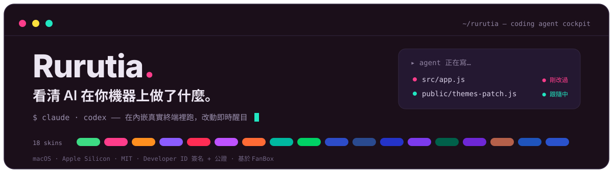
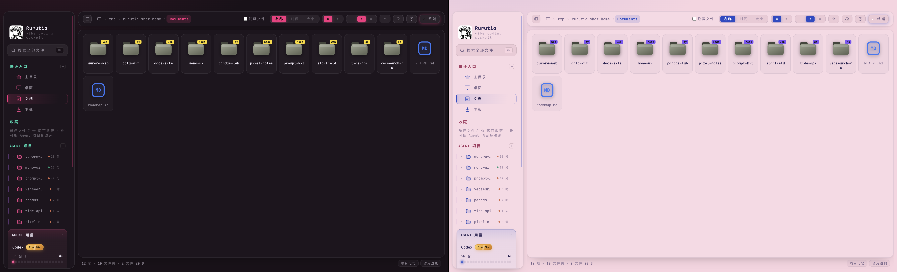
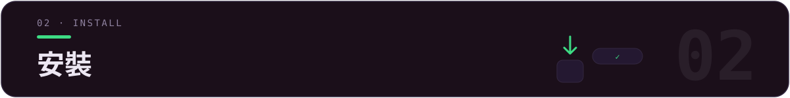
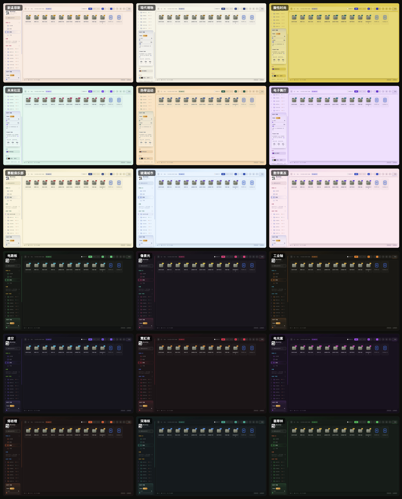
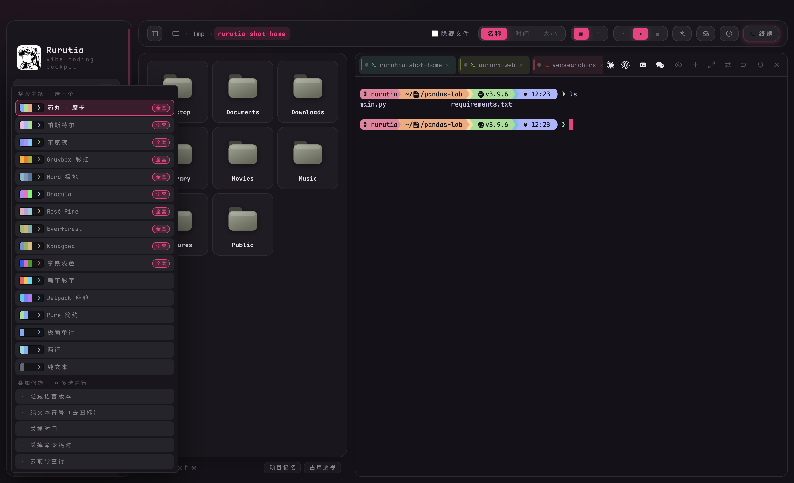
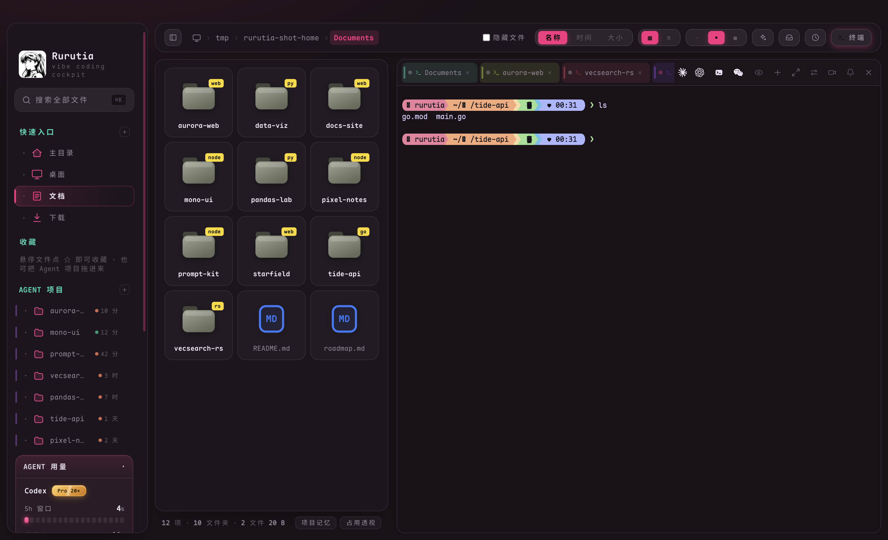
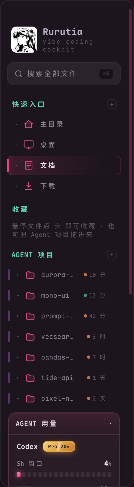
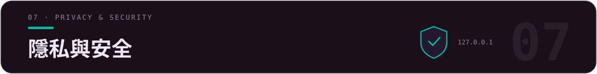

<div align="center">



[](LICENSE)
[](../../releases)
[](../../releases)
[](../../releases)
[](https://github.com/alchaincyf/fanbox)

[简体中文](README.md) · **繁體中文** · [English](README.en.md) · [日本語](README.ja.md) · [한국어](README.ko.md) · [Français](README.fr.md) · [Español](README.es.md)

</div>

<p align="center">
  
</p>
<p align="center"><sub>▲ 主介面總覽 —— 同一介面、左深「像素光」右淺「數位果凍」。檔案網格帶強色專案徽章，側邊欄彙總 Agent 專案與官方用量。</sub></p>

> **✨ 最近更新**：v2.11 觀察艙（終端機工作狀態面板）——任務倒數 + 子任務慶祝 + 進度翻綠互動 · v2.10 截圖直通升級工具列一等按鈕 · v2.9 終端配色跟隨皮膚 + 20 槽位自選 · 回合存檔一鍵回滾 · 11 個 coding agent 一鍵啟動 · 合併上游 FanBox v2.6.2。


| 你想做的事 | 在 Rurutia 裡 |
|---|---|
| 找回一個下午亂起的十個專案 | `⌘K` 全域模糊搜尋 · 資料夾標 node/web/py/rs/go 徽章一眼認出類型 |
| 讓 agent 做事、還能看清它改了啥 | 內嵌真實終端機跑 Claude Code / Codex；它寫哪個檔案，那張卡片當場發光、預覽即時跟隨 |
| 接續昨天的工作階段 | 點開專案看歷史工作階段，「▶ 接續」一鍵 `claude --resume` / `codex resume` 接回上下文 |
| 盯住官方用量別超額 | 側邊欄常顯 Claude / Codex 的 5h 視窗 + 週配額，接近上限紅條 + 桌面通知 |
| 讓整個介面隨心情換裝 | 18 套配色皮膚 + 16 套終端機提示符主題，UI / 終端機 / 程式碼高亮一起變 |



**macOS（Apple Silicon / arm64）**

1. 到 [**Releases**](../../releases) 下載最新 `Rurutia-*.dmg`。
2. 打開 dmg，把 **Rurutia** 拖進「應用程式」。
3. 雙擊打開即可使用。

> ✅ 已用 **Apple Developer ID 憑證簽名 + Apple 公證 + hardened runtime**：下載後雙擊直接用，不會彈「無法驗證開發者」。


[**FanBox**](https://github.com/alchaincyf/fanbox)（作者：[花叔](https://github.com/alchaincyf)）是一個在本機執行的「**coding agent 駕駛艙**」：一邊瀏覽 / 預覽 / 編輯本機檔案，一邊在內嵌真實終端機裡跑 Claude Code、Codex 或任何 coding agent——agent 改了哪個檔案即時高亮，**找回檔案 → 執行 agent → 看清改動**在一個視窗完成。零依賴後端，資料不出本機。

> *"AI 幫你一個下午起十個專案，然後它們就再也找不到了。FanBox 幫你把它們找回來。"*

**Rurutia** 是我在 FanBox 基礎上做的**個人增強分支**：核心能力 100% 來自上游，我重做了視覺 / 字型 / 配色，加了皮膚與終端機提示符兩套系統，並打磨了幾十處日常順手度。


> 圍繞四件事：**好看、好認、好用的終端機、少打擾**。

### 🎨 18 套配色皮膚

每套是「中性底 + 3 個並列強調色 + 一組語意狀態色」，正文 / 強調色 / 徽章字 / 終端機 16 ANSI **全部過 WCAG 對比度校驗**；切一套皮膚，主介面、側邊欄、終端配色、程式碼高亮、Monaco 底色一起換。9 淺 9 深，靈感來自公眾號「色所」。

<p align="center">
  
</p>
<p align="center"><sub>▲ 18 套皮膚總覽（9 淺 9 深）。預設「像素光」。</sub></p>

整體 UI 同步現代化：髮絲邊框、統一圓角節奏、膠囊分段控制項、克制的過渡動效；介面 / 檔名 / 程式碼 / 終端機統一 **Maple Mono CN**（中文 + 假名全字元，內嵌 woff2，離線可用）。

### 🚀 終端機提示符（自帶 Starship · 16 套主題）

開箱即是 powerline 藥丸提示符（目錄 / git 狀態 / 語言版本 / 時間）——**不用裝 starship、不用設定 `~/.zshrc`**。走 ZDOTDIR 注入：先 source 你真實的 dotfile（PATH / 別名分毫不差），再疊加 starship；**只在本 App 終端機生效、不碰任何 dotfile、解除安裝零殘留**（macOS + zsh）。

<p align="center">
  
</p>
<p align="center"><sub>▲ 16 套主題任選一 + 5 個修飾可疊加；切換即時生效，正在跑的終端機按 Enter 就變樣。</sub></p>

### 🎛 終端機配色 · 跟皮膚走，還能自己選

終端機 16 ANSI 不再是 18 套皮膚共用一副：藍 / 品紅 / 青按色相就近換成該皮膚的強調色本尊，紅 / 綠 / 黃保住語義；`dark-ansi` 下跑 Claude Code / Codex，換皮膚終端機介面色跟著換。想更個性化：「**終端配色**」面板 20 個槽位全按 Claude Code 實際用途標註（框線 / 錯誤 / 成功 / 連結路徑…），取色器點開即改、所有終端機即時變色、每套皮膚分開記憶。淺色 9 套整體降亮度（最亮表面壓到 64% 以下）——長時間盯著不刺眼。

### 🖥 終端機 · 品牌圖示 + 彩虹標籤

<p align="center">
  
</p>
<p align="center"><sub>▲ 標籤按專案黃金角配色，頂欄官方品牌圖示直接啟動 Claude / Codex / 微信。</sub></p>

- **品牌圖示工具列**：Claude Code / Codex / 微信 等入口用官方向量圖示，其餘動作按鈕重繪為跟隨主題色的單色向量。
- **彩虹標籤**：每個終端機標籤按專案黃金角取色，多專案並排自動錯開成一道彩虹；寬度自適應、可彈性拖曳換位。
- **「普通終端機」按鈕**：一鍵在目前資料夾開個乾淨 shell（不帶 agent）。
- **獨立圓角終端機卡**：背景融入目前皮膚，深色下不再是突兀的純黑方塊。

### 🗂 側邊欄 · 入口與用量

<p align="center">
  
</p>

- **快速入口 / Agent 專案可增刪可排序**：➕ 加入、懸停 ✕ 移除、拖曳自訂順序，全部持久化。
- **用量面板增強**：Claude Code 官方限額（5h 視窗 / 週配額）恆顯，取不到寫明原因 + 重試；≥85% 紅色警告條 + 桌面通知；10 分鐘快取扛住官方限流。

### 其餘打磨

點紅 ✕ = 隱藏視窗而非殺終端機（⌘Q 才真退）· 視窗頂部整條可拖曳 · 捲軸細圓跟隨強調色 · 預設連接埠被佔自動順延（多實例不衝突）· 自訂應用程式圖示與 logo · **介面語言 7 種**（簡中 / 繁中 / EN / 日 / 韓 / 法 / 西，使用者內容區不翻譯）。


搜尋與預覽、活的改動儀表板、跟隨模式、工作階段回放、變更收件匣、Git diff、專案記憶與一鍵接續工作階段、截圖直通車、AI 整理、發版精靈、Skills 透視、回合存檔、真實內嵌終端機與 11 個 agent 一鍵啟動、所見即所得編輯……

<details>
<summary><b>展開完整功能清單</b></summary>

### 🗂 檔案 · 找回與預覽
- **⌘K 全域模糊搜尋**：記得名字片段就行；`⌘↵` 用編輯器整包打開專案；`内容:关键词` 切全文搜尋。
- **強色實體圖示**：每種檔案「長得像它自己」——PDF 紅、JS 黃、Markdown 藍；照片影片按真實比例呈現。
- **原地預覽**：Markdown 渲染、HTML 即時成品、程式碼語法高亮、圖片/影片/PDF 內嵌（含 HEIC）、壓縮檔清單。
- **縮圖加速**：大資料夾捲動和點擊都在 0.1 秒內。
- **專案徽章**：資料夾卡片標 node / web / py / rs / go。

### 👀 看 agent 改了什麼
- **活的儀表板**：agent 每寫一個檔案，那張卡片當場盪開漣漪、按改動頻率發光呼吸。
- **跟隨模式**：檔案檢視 + 預覽追蹤 agent 正在編輯的檔案——程式碼隨新寫行高亮，HTML 雙緩衝即時渲染零白閃；手動瀏覽立即交還控制權。
- **工作階段回放**：拖時間軸重現 agent 一步步改了哪些檔案。
- **變更收件匣**：跨專案彙總本工作階段所有被改動的檔案。
- **Git 改動 diff**：Monaco DiffEditor 並排 HEAD vs 工作區。

### 🤖 Agent 駕駛艙
- **專案記憶**：歷史工作階段（你的第一句話當標題）、每次改過的檔案、觸發過的 skill；「▶ 接續」一鍵接回上下文。
- **截圖直通車**：系統截圖落盤即浮出直通卡——餵給 agent、收進專案素材、或標註後再發。
- **AI 整理**：AI 只看中繼資料出提案（不讀內容），逐條過人後執行 + 可整體復原。
- **發版精靈**：node 專案一鍵串起版本號、CHANGELOG、打包、GitHub Release。
- **Skills 透視**：本機全部 agent skills 一個檢視——觸發統計、健康檢查、context 預算、不刪檔案的啟停。
- **Agent 用量**：Claude Code 官方 5h 視窗/週配額 + 本機 token 統計；Codex 限額快照。
- **回合存檔（安全帶）**：agent 每輪開工前自動存完整專案狀態（非 git 專案走影子 git），一鍵回到任意一輪之前。
- **磁碟佔用透視**：`du` 口徑真實佔用長條榜，可下鑽。

### 🖥 終端機 · 指揮 agent
- **真實內嵌終端機**：node-pty + xterm.js（WebGL），跑 Claude Code / vim / htop 不花屏，中文寬字元正確。
- **拖檔案進終端機**：自動插入路徑餵給 agent 當上下文。
- **路徑可點擊**：帶空格、中文名、折行長路徑都能識別。
- **選中即丟給終端機**：預覽裡選一段文字，以「檔案出處 + 圍欄」格式發進終端機。
- **態勢感知**：標籤圓點顯示運行/閒置/退出；輪到你時終端機邊緣呼吸提示，長任務完成發系統通知。
- **11 個 coding agent 一鍵啟動**：內建註冊表（Claude Code / Codex / Hermes / Kimi / opencode…），未裝的一鍵複製安裝指令，config.json 可自訂。
- **更新膠囊**：有新版本時頂欄浮出，一鍵下載 dmg。

### ✍️ 編輯 · 所見即所得
- **Markdown**：Milkdown Crepe（Notion 式），停筆 0.8 秒自動儲存。
- **程式碼/JSON**：Monaco（VS Code 同款核心）。
- **圖片標註**：畫筆/箭頭/文字/馬賽克、格式轉換、壓縮。
- **未儲存守衛**：三種編輯器統一攔截未儲存退出。

原始英文版說明見 [`README.fanbox.md`](README.fanbox.md)。

</details>


```bash
npm install
npm run rebuild        # 把 node-pty 重編到 Electron 的 ABI

# 未簽名本地建置（自己用）：
CSC_IDENTITY_AUTO_DISCOVERY=false npx electron-builder --mac --dir -c.mac.identity=null
# 產物：dist/mac-arm64/Rurutia.app
```

改動以**追加式補丁**組織（`ui-patch.css` / `themes-patch.js` / `prompt-patch.js` 等新增檔案 + 少量上游檔案編輯），方便上游出新版後 `git rebase` 重新套用——完整清單與套用步驟見 [`RURUTIA-PATCH.md`](RURUTIA-PATCH.md)。



> 與上游 FanBox 一致，Rurutia 不改變其安全模型。

- 後端只在本機回送位址監聽 + 校驗 Host 頭，**資料不出本機**。
- 前端資源（渲染器、字型、starship 二進位）全部本機內建，**離線完全可用**；唯一的對外網路請求是 Claude / Codex 用量介面（選用）與 GitHub 更新檢查。
- HTML 預覽在隔離 origin 的沙箱 iframe 裡渲染，碰不到終端機能力。
- 提示符走 ZDOTDIR 注入，**不寫不改任何 dotfile**，解除安裝零殘留。
- 設定原子寫（temp + fsync + rename）；刪除走系統垃圾桶（可復原）。


| 層 | 用什麼 |
|---|---|
| 後端 | 零依賴 Node.js `server.js`（檔案 API + 靜態服務 + 縮圖） |
| 桌面殼 | Electron 33 + node-pty（asarUnpack 原生模組） |
| 終端機 | xterm.js + WebGL + unicode11 |
| 提示符 | 內建 starship（已簽名公證）+ Nerd Font，ZDOTDIR 執行階段注入 |
| 編輯器 | Monaco（程式碼）+ Milkdown Crepe（Markdown） |
| 字型 | Maple Mono CN（內嵌 woff2） |
| 打包 | electron-builder → 簽名 + 公證的 arm64 `.dmg` |


- 核心應用 **FanBox** 由 **[花叔](https://github.com/alchaincyf)**（[alchaincyf/fanbox](https://github.com/alchaincyf/fanbox)）開發，MIT 授權。Rurutia 是其個人增強分支，遵循同一 [MIT 授權](LICENSE)。完整上游依賴名單見 [`README.fanbox.md`](README.fanbox.md)。
- 字型 **Maple Mono** 來自 [subframe7536/maple-font](https://github.com/subframe7536/maple-font)（OFL）。
- 終端機提示符 **Starship** 來自 [starship/starship](https://github.com/starship/starship)（ISC）。
- 配色靈感來自公眾號「**色所**」的高級感配色合集。

<div align="center">
<br>

**Finder** 幫你管理檔案。**IDE** 幫你寫程式碼。**Rurutia / FanBox** 幫你看清 AI 在你機器上做了什麼。

MIT License © Rurutia · 基於 [花叔 Huashu 的 FanBox](https://github.com/alchaincyf/fanbox)

</div>
</content>
